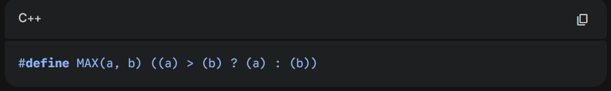
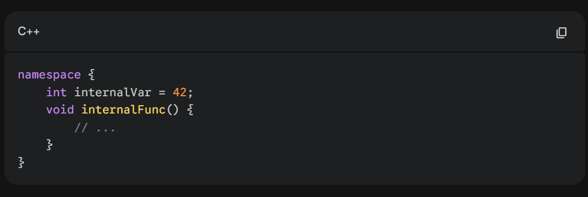
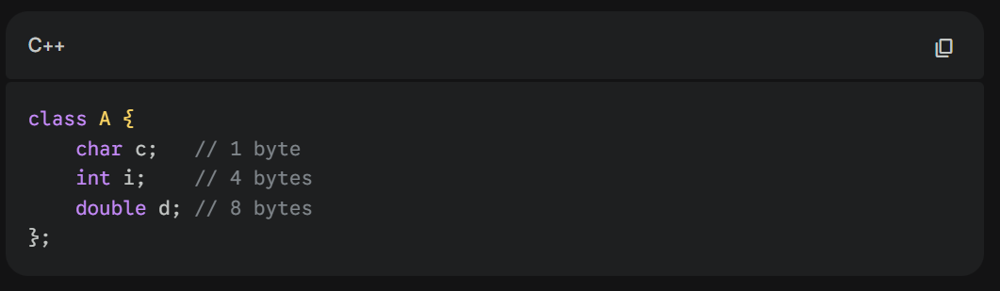
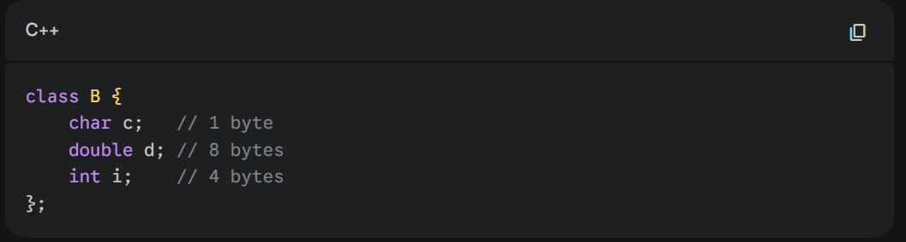
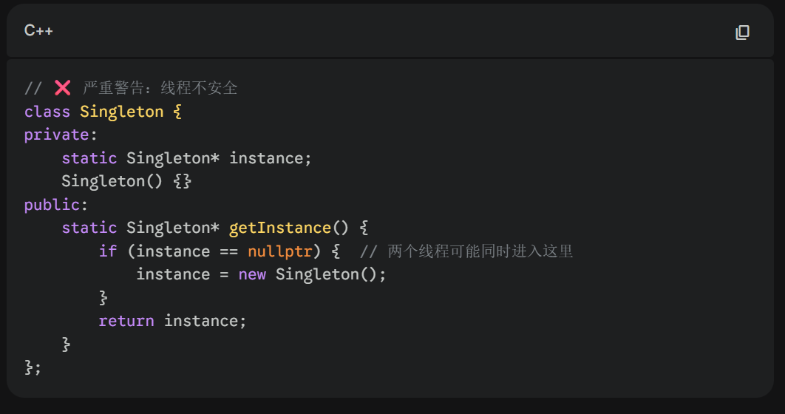
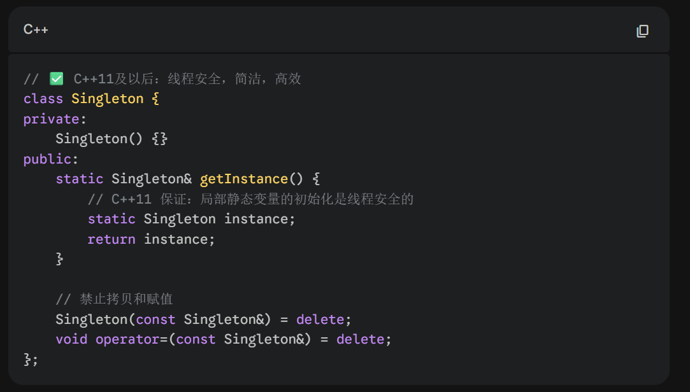
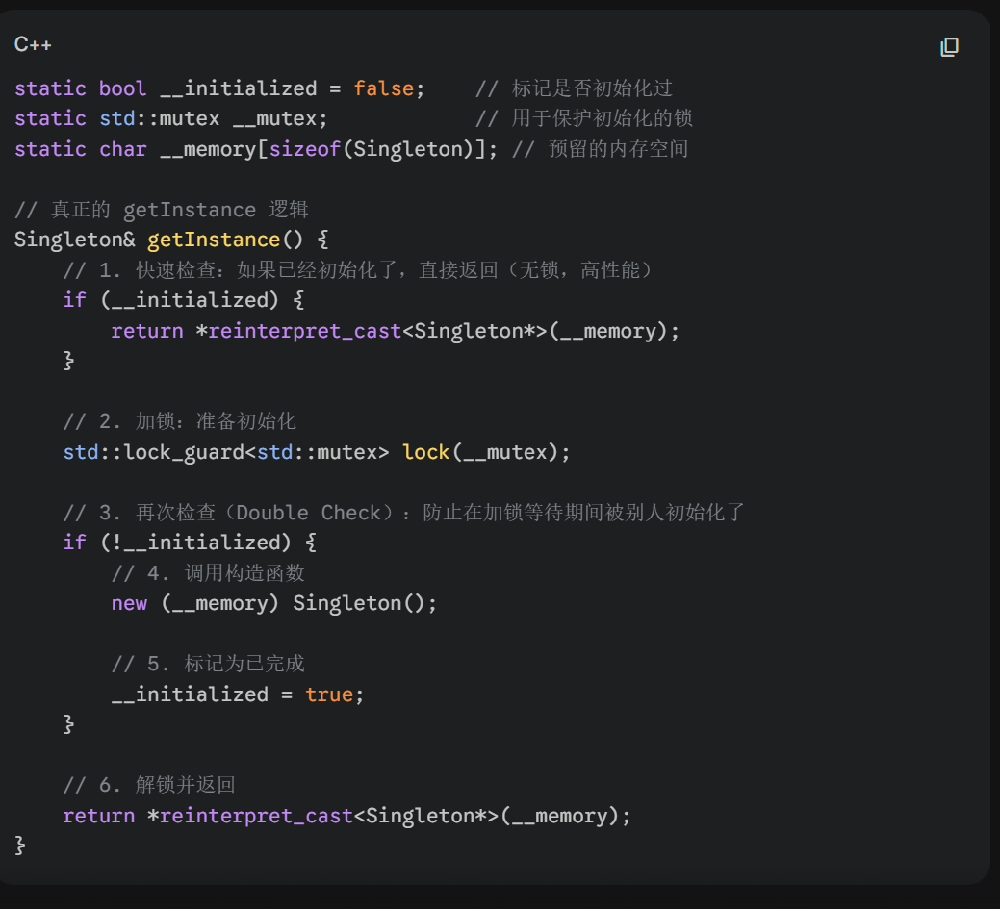
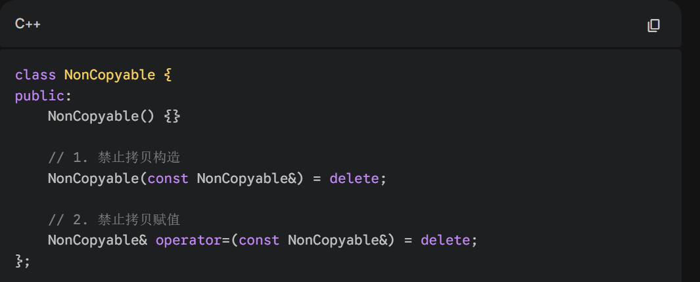
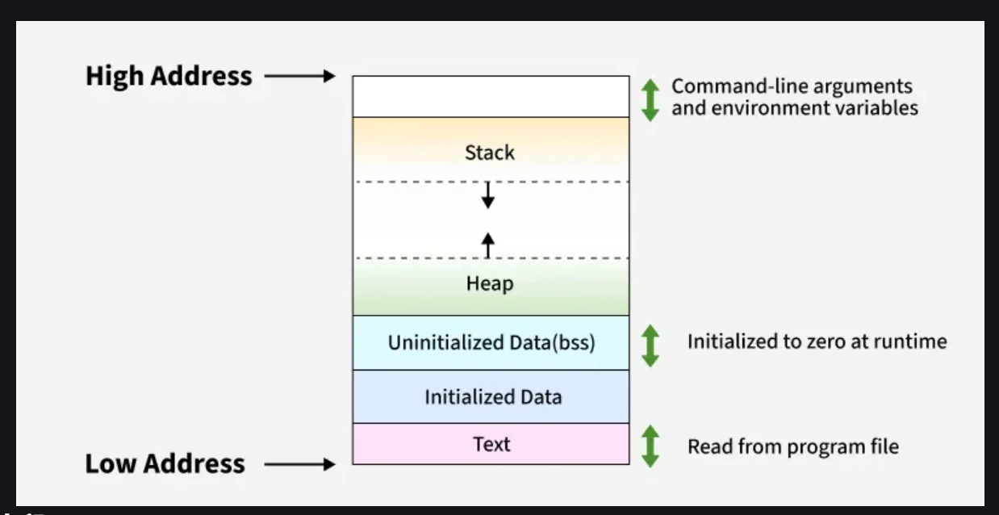
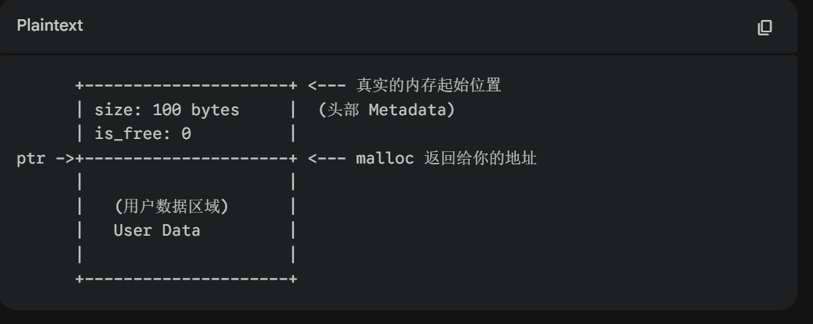

# Week 6 Homework
This homework primarily addresses the questions remaining from the Week 6 presentation.

## Q1: What is the difference between the keyword inline and keyword #define?
### What is #define?
#define is a preprocessor directive used to define macros. Macros are identifiers defined by #define that are replaced by their corresponding values before compilation.
Here is an example:

Because a macro is defined, when the compiler performs preprocessing, all the MAX(a,b) are replaced by the ((a)>(b) ? (a) : (B)), and this property is similar to that of inline functions. However, #define works before the program compilation, whereas inline functions are handled during compilation.

### What is the difference?
There are five main differences between the keyword #define and the keyword inline. First, #define does not check the type of its input, which can lead to many errors. In the example above, you can input MAX(a,6), it doesn't cause any problem when complier copy the #define to the target place, but it will cause error when program working. However, as a function, inline function can check the input type and alarm when inputing. The second difference is that because inline function is a function, it can be optimized by compiler. But #define works before compilation, so the compiler cannot optimize them. The preprocessor merely copies and pastes the words and it doesn't understand the c++ syntax,that's why inline functions often offer better performance. The third difference concerns debugging. When debugging, the debugger can track calls to inline functions, making it easier to identify problems. However, #define can't be tracked by the debugger, which makes it harder to locate issues. Next, inline functions can be place in the namespace so that they have low possibility to have a name conflict. On the contrary, #define work in the whole project, if you use many #define in one single project, the problem of name conflict may be huge. The last one is that inline functions always have better readability, and inline functions accept overload, which is not allowed in #define (because #define doesn't check the input type at all).

## Q2: Questions about keyword const
### const int* p
For const int* p, which means you cannot change the value of the variable through this pointer. However, if the variable pointed to by the pointer is a int type initially, you can change the variable directly, but you still cannot modify it through the pointer.

### int* const p
For int* const p, you cannot change the address that this pointer holds. However, you can modify the value stored at that address. Additionally, you cannot declare int* const p but don't give a value to it (you don't define it).

### int exampleFunction(int a) const
For a function with the const keyword after the parenthesis, this const means that this function will never change the values of any member varibles of this object. Remember, this form cannot be used out of the member functions of classes or structs. Furthermore, only const objects can call const functions.

## Q3: Difference between friend keyword in private and that in public

In conclusion, there is no difference between the friend keyword in private and that in public. Because the friend function doesn't belong to the class where it is, keywords private and public cannot control it.

## Q4: Details of anonymous namespace
Here is an example of anonymous namespace:

An anonymous namespace is a namespace without a name. When the compiler works, it gives a unique name to this namespace, which is invisible outside. In the anonymous namespace, scoping of all the contents is the file. As a result, if you set a class in the anonymous namespace, you can not find this class in another file, even if you use the extern keyword. The effect of the anonymous namespace is close to the static keyword, but people always prefer to use an anonymous namespace in C++.

### What is the difference between static keyword and anonymous namespace?

First of all, the contents of the static keyword and anonymous namespace are different. The static keyword can only be used for functions and variables, but an anonymous namespace can include classes, structs, and enums. Obviously, the anonymous namespace has a large scale.  Moreover, an anonymous namespace is easier to use in templates, such as template overload. As a result, people use anonymous namespaces more.

## Q5: How to calculate the size of a class
There are five factors that will be considered when you are calculating the size of a class: non-static data members, padding, virtual functions, inheritance, and empty classes.

### Non-static data members and padding
The size of non-static data members can be simply calculated by the size of the data types that the members are, but padding is a difficult step during the calculation. Here is an example:

In this example, the size of all non-static data members is $1+4+8=13$. However, the calculation should follow the rules of padding: members align and overall alignment.

Due to the members aligning, the size before adding the target member should be an integral multiple of the size of the target member. For example, when adding the size char c, there is no offset, and the size becomes 1. When adding the int i, 1 is not an integral multiple of 4, so the size needs to be padded to 4, and add the size of int i; after that, the size becomes 8. Then, adding the double d, the size now is 8, which is an integral multiple of 8, so no more offsets need to be padded; the size of this class should be 16.

If we change the sequence of thewe members, the calculation will be different.

In this example, the first step is the same as the previous calculation. In step 2, we need to add the double d first, so the size before adding needs to be 8; now the size is 16. Next, because 16 is an integral multiple of 4, int i can be added directly, and the size now is 20. However, we need to follow the overall alignment, which means the size of a class must be an integral multiple of the biggest member. In this example, the biggest one is double d, the size of it is 8, so finally the size of the class needs to be enlarged from 20 to 24.

### Virtual functions and inheritance
In terms of base class and derived class, you need to add the size of the base class to the derived class. However, the offset of overall alignment from the base class can be used by the derived class. For example, in the last example, the size before overall alignment is 20; if the first member of the derived class is a char or an int (20 is the integral multiple of 1 or 4), it can be added directly and make the size 21 or 24.

If the base class and derived class include the virtual function, the size of vtpr needs to be added first. The size of vtpr should be 4 (32-bit system) or 8 (64-bit system). Moreover, if a derived class inherits many base classes with virtual functions, it will have many vtpr.

We can have an example here:

As we see, class C is a derived class of class A and class B. Both of the base classes have a virtual function, so the calculation frame is: vtpr(A) -> size of class A -> vtpr(B) -> size of class B -> size of class C. Every vtpr needs 8 bits and 8 is an integral multiple of 4 (int), so size of first two step is 12. There is a same situation in next two step. However, between the step 2 and step 3, because 12 is not an integral multiple of 8, 4 bits padding is needed. As a result, after the first four steps, the size is 28. 28 is an integral multiple of 4, therefore class C can be added directly without padding. Finally, the size of class C is 32.

Another special form is diamond inheritance. In last example, if there is a class D the base class of class A and class B, the relationship between class D and class C is a diamond inheritance. It has two main drawback: data redundancy and ambiguity. Data redundancy means that the size of class D will be calculated twice. Ambiguity means when you call a varirable belongs to class D, conpiler can not understand which one you wand to use because both class C and class D hold the varirables of class A.

To solve this problem, programmers use the virtual inheritance. Virtual inheritance tells the compiler that the instance of base class should only be created once, even it is used many times. Return to the example, if class A and class B are virtual inheritance, There is only one instance of class D created when compiler is create a instance of class C. Because of that, the size of class C will be changed.

Here is an example. The calculation frame is vbptr(B) -> size of class B -> vbptr(C) -> size of class C -> size of class D -> size of class A. The first five steps are same to the above example, and we need to add the size of class A now. After that, the size is 36 bits. However, 36 is not an integral multiple of the largest member (8 bits), so there are 4 padding used and the final size is 40 bits.

### Empty class
The size of an empty class is always 1. For a derived class, if the base class is an empty class, the size of the empty class can be calculated as 0. However, if the derived class includes a member whose type is the base class, the size of the base class needs to be calculated as 1.

## Q6: The thread safety issue of the singleton pattern
### Normal singleton pattern
In conclution, triditional singleton pattern is not thread safe. Here is an example:

In this singleton pattern, there isn't a double check. If thread A confirms the instance is a nullptr, but A is stopped before it creates a new instance, then thread B works and confirms the instance is a nullptr and creates a new instance. After that, A works again and creates a new instance continuously, and there are two instances existing finally, which is not allowed in the singleton pattern. As a result, the normal singleton pattern is not thread safe.

### Meyers' singleton
Meyers' singleton can confirm the thread safety. Here is an example:

Instead of the if statement, Meyers' singleton uses a static Singleton instance to ensure thread safety. When the compiler reads this line, the inside frame looks like this:

Compiler checks if the initialization is finished first; if it doesn't finish, compiler locks it to make sure other threads can't create an instance at the same time. After that, to ensure that no other threads create the instance before the lock works successfully, the compiler checks the initialization again. If the double check is completed, the compiler can create the instance and change the flag so that other threads will never create an instance again. Through the double check, Mayers' singleton is thread safe.

## Q7: Functions with = delete
Here is an example:

The function of "= delete" is to ban some operations. In this example, people can't use the copy constructor and copy operator to ensure this function is monopolized. The aim of this is to avoid some misuse of the functions. For example, you set a function overload with input type float, and you don't want people to input an int, to avoid the compiler changing the int to the float and causing an error, you should ban the function overload with input type int. Another situation is that if you don't want people to create a new instance on the heap, you can use "= delete" to reject the "new" sentence.

## Q8: How to use the smart pointer?
The usage of different kinds of smart devices is based on the understanding and judgment of programmers. We can analyze some typical examples to better understand the smart pointers.

In general, a unique pointer is used for sources that do not need to be shared. For example, when you deal with a network packet, you want the packet to be received first, then parsed, and finally deleted. As a result, you can use a unique pointer to ensure that there is not more than one module using the smart pointer at the same time.

In terms of the shared pointer, if you need to control the sources and use them many times, or you are one of the owners of the sources, you should use the shared pointer. For example, if you create a game that needs 100 monsters at the same time, you should use the shared pointer to manage the textures so that the textures will be deleted after the last monster dies.

If you are just an observer of sources, which means you just get the reference of the sources but do not really hold them, you should use the weak pointer. Another usage of a weak pointer is to avoid two smart pointers calling each other. In other words, sources exist or disappear, should not be controlled by the observer; the observer just needs to know if the sources still exist. For example, here is a chatroom, and many users chat in the chatroom. However, chatroom should not influent if the users exist, users can be deleted without deleting the chatroom. For the chatroom, if there is a new message sent into the chatroom, it just checks if the users exist and sends the message to the existing users by locking the weak pointer.

## Q9: Operating principle of malloc and free
Malloc and free are the methods to help programmers control memory management. The frame of data should be this:

A programmer can only apply for space in the heap by using malloc. You need to determine the size of memory you want and tell the compiler. The compiler always finds the first enough space in the free List (this operation may cause fragmentation), writes the head, and returns the first address after the head, like this:

The space you get is always larger than you want because of rules such as the padding rule.

After using the memory space, you need to use free to clear the space and return it to the free list. You don't have to tell the size of the memory space because the compiler can check the head and clear the space following the information in the head.

### Special circumstances: if I create a new array including 10 int variables, then I free two of them (like 2 and 6), now I add a new int variable to the array, where will this variable be placed?

In general, a programmer cannot just free some elements of an array unless all the elements are added to the array one by one. In this situation, there is a high probability that this new variable will reuse the space of the 6th place. First of all, the compiler will try to reuse the space, and these free spaces will follow the "first in, last out" principle, so the 6th place will be used first because it is the last free place.

Furthermore, if the compiler fails to manage the space, it will return an empty pointer. As a result, programmers should compare the null with the pointer when applying a new pointer every time.
