# Vulkan Initialization
This notes will cover contents from week 7 to week 10. After this note, we can complete the initialization for Vulkan.

## Part one: Before Vulkan
Before we start to use Vulkan, we need some basic setting first.

### SDK & Software
Like buying materials before cooking, we should prepare SDK and software which will be used. At first, we need Vulkan SDK, Visual Studio, Git, CMake and any AI to help you.

### Project Creation
We can start our program now. Select "empty project" in Visual Studio, create a text file and name it "CMakeLists.txt", which is used to add depandencies.

In CMakeList, we should finish some basic settings first. we ragulate the lowest version of CMake, name the project, and add the main into the program, like this:
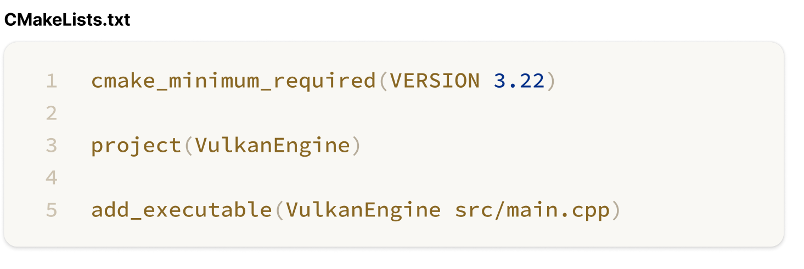

At the same time, you need to add a new file called "main" into the src document. you can wirte some easy program in the main and click the "VulkanEngine.exe" to test if the program can run well.

Next, we should add many depandencies we will use into the CMakeLists. Write find_package (Vulkan REQUIRED) and target_link_libraries (VulkanEngine PRIVATE Vulkan::Vulkan) into the CMakeLists, you can include <vulkan/vulkan.h> without any errors after this step. This is the first depandency we need.

 to configure CMake to automatically collect and build any files that we put into the source directories, we need add all .h and .cpp document into it, like this:
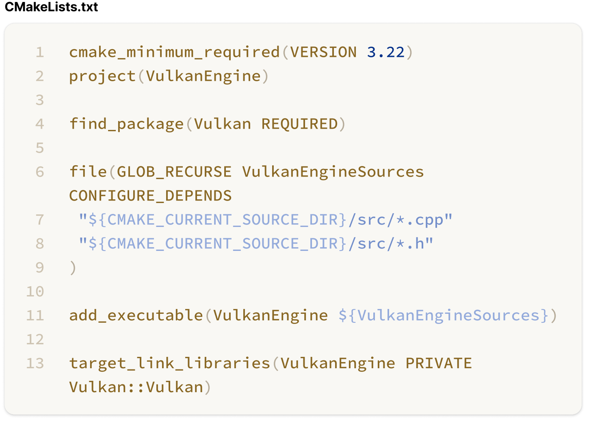

To make the source directory to be a root path, we add target_include_directories (VulkanEngine PRIVATE "${CMAKE_CURRENT_SOURCE_DIR}/src"). 

Next step is set standard C++ to C++20, Then fitch some contents from GitHub. We should add glm and GLFW into it, like this:
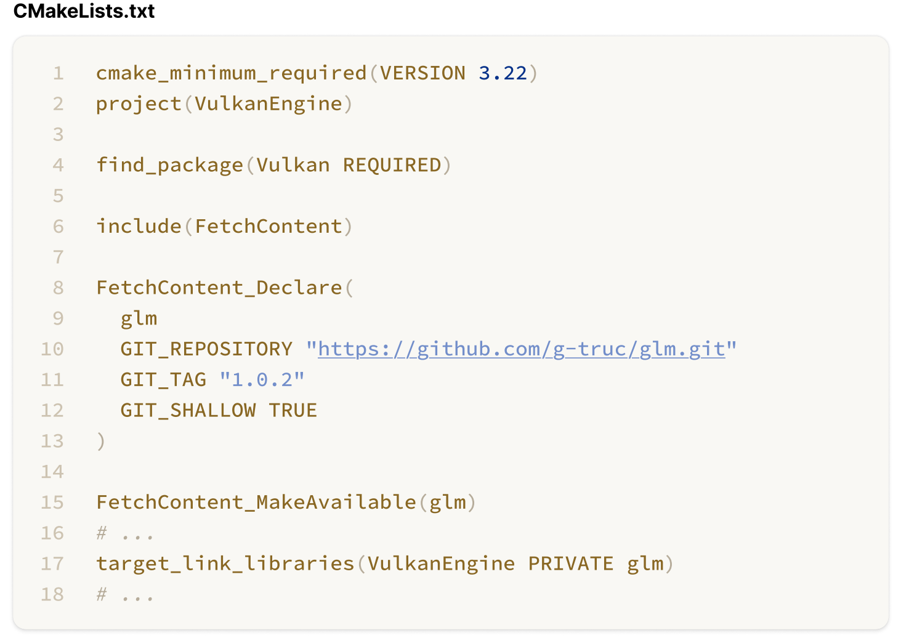

### Code Style
Before really write some code, we can set our code style first to ragulate it automatically.
const 
char*

First of all, include <cstdint> and <cmath> in main.cpp. Next, we should fitch the GSL (Guideline Support Library) into the CMakeLists, which can help us write safer code. There are two stuff we will use always: gsl::span<T> and gsl::not_null<TPointer>. The function of the first one is to wraps a collection that is represented by a pointer and a size of sequential memory. The second is used to ensures that a given pointer is not null.

Moreover, we can use gsl::zstring to replace the char*, and use gsl::czstring to replace const char*.

To set a Google C/C++ code style, we need to add a .clang-format file into solution, and the file is this:
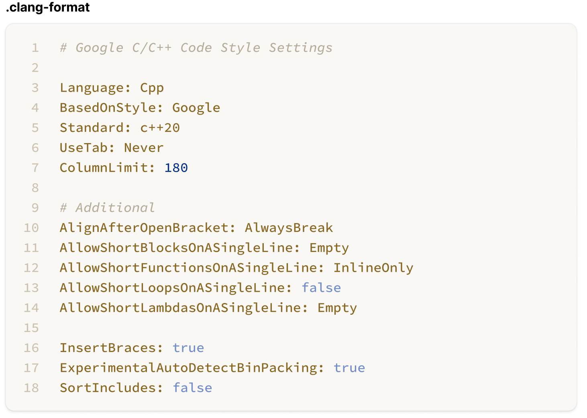

Then add a .editorconfig file into solution too, like this:
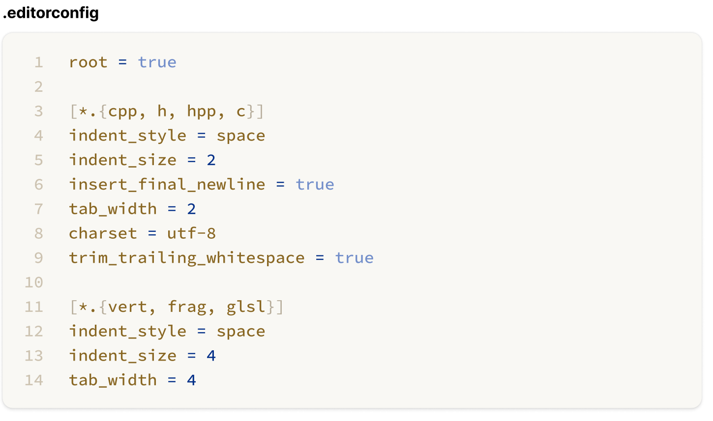

After the steps above, we can press ctrl-K and ctrl-D to reformat our code.

### Basic Class
This is the final step before we start using Vulkan. First, we need to confirm which monitor we will use and determine the window's appearance. To achieve this, we use GLFW to create windows and manage handles.

Instead of writing everything in main.cpp, we can use the RAII (Resource Acquisition Is Initialization) principle to better manage resource creation and destruction. Therefore, we can create glfw_initialization.h and glfw_initialization.cpp and implement the constructor and destructor in them, as shown below:
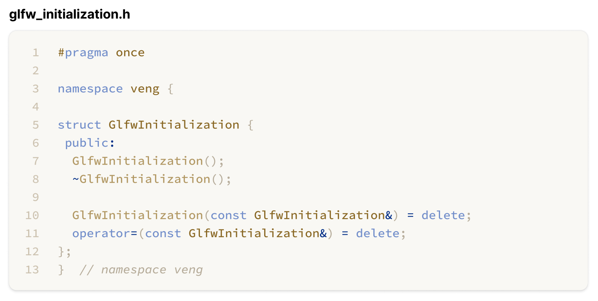

After this, we can simply write veng GlfwInitialization _glfw; to initialize GLFW.

We can do the same to create a window. First, add a window.cpp file to the src directory, and write the constructor and destructor for it.

To be more convenient, we can create a precompiled header and add it to the CMakeLists to include the headers we need.

Next, we should consider about the monitor. Let's include the <glm/glm.hpp> in procomp.h at first. Now we can get our monitor position, the code like this:
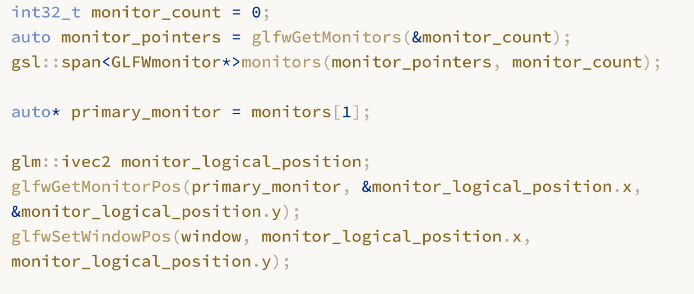
And recenter the window:
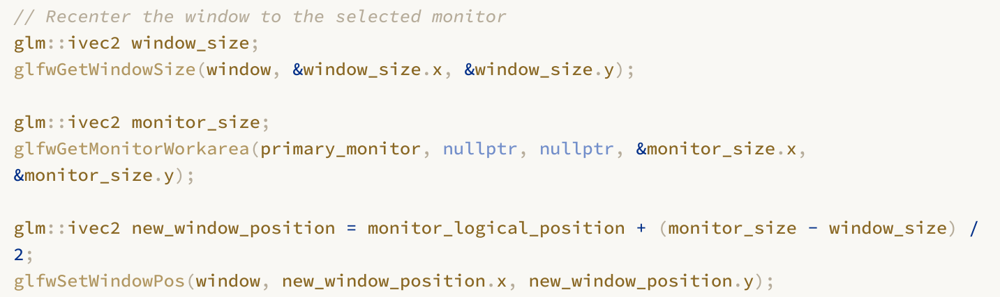
Put all of them into glfw_monitor.h:
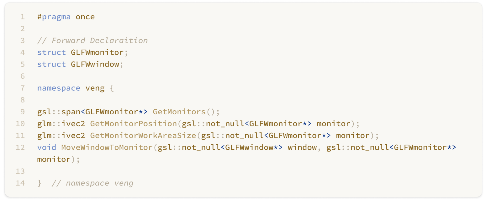
Specificly, we need to forward declare the GLFWmointor and GLFWwindow to avoid errors.

Finally, we can update the window class to finish our basic class, like this:
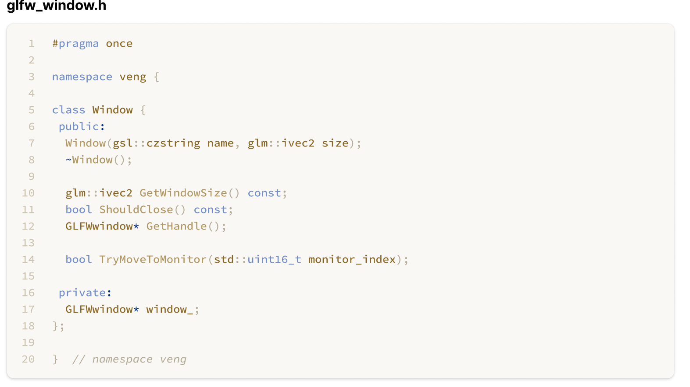

## Vulkan Overview
First of all, to use the vulkan, we will create graphics.h and graphics.cpp which will store all code we use.

### Vulkan Instance
The Vulkan instance is the environment that provides Vulkan's functions. We use this instance to perform all operations through Vulkan.

To create the Vulkan instance, we first add the InitializeVulkan() and CreateInstance() functions to graphics.h. Then, we call these functions within the constructor in graphics.cpp to utilize them.

In Vulkan, creating objects always requires a structure called VkApplicationInfo, we declare a VkApplicationInfo by filling out its fields, similar to completing a form.
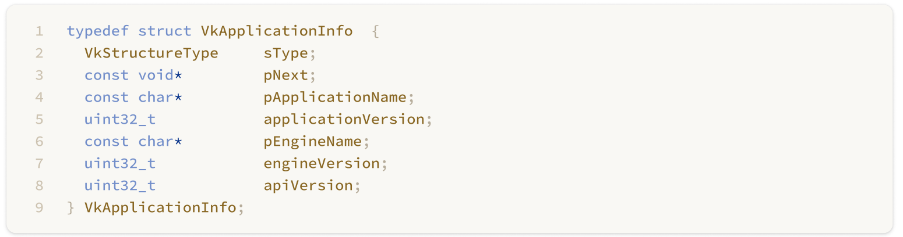

We can examine the contents of the VkApplicationInfo and need to confirm every variable in it. We highlight some of them which are particularly important. The first is VkStructureType (sType). In Vulkan, almost ...Info need a sType and VK_STRUCTURE_TYPE_APPLICATION_INFO is assigned here. We will encounter different sType values later. Another critical variable is pNext, which is designed to add additional information to accommodate different devices. Normally, we can simply set this to nullptr; however, when more information is needed for a new device, we can store that information elsewhere and use this pointer to link the two parts as a single entity. This approach is sensible because it allows for easy extension of information without affecting the original structure.

Next, we focus on the VkInstanceCreateInfo, which will use the VkApplicationInfo we set before. The sType of this structure is VK_STRUCTURE_TYPE_INSTANCE_CREATE_INFO, moreover, we need to obtain the suggested extensions.

To obtain the suggested extensions, first add the function GetSuggestedExtensions().
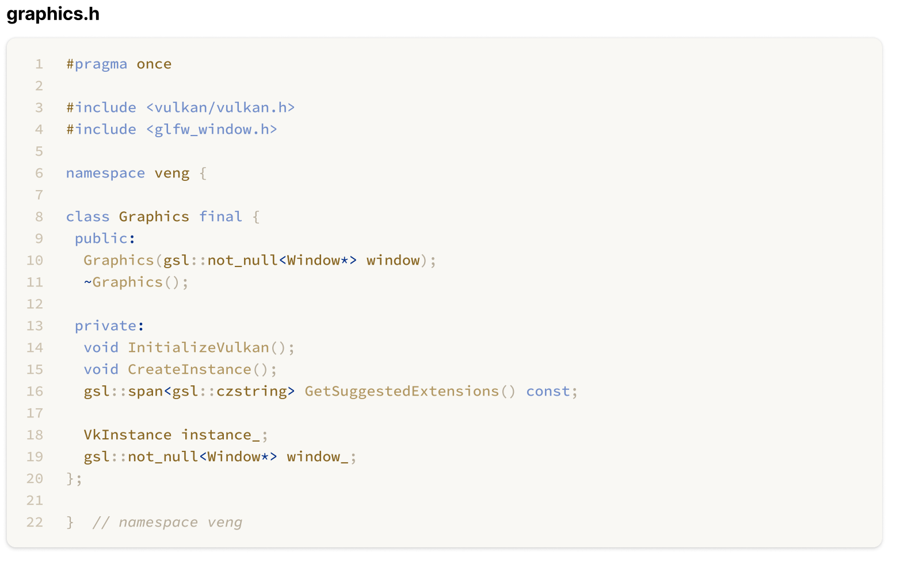

After complete the code in the .cpp file, we can use it to get all suggested extensions, and write the quantity and name into the VkInstanceCreateInfo, like this:
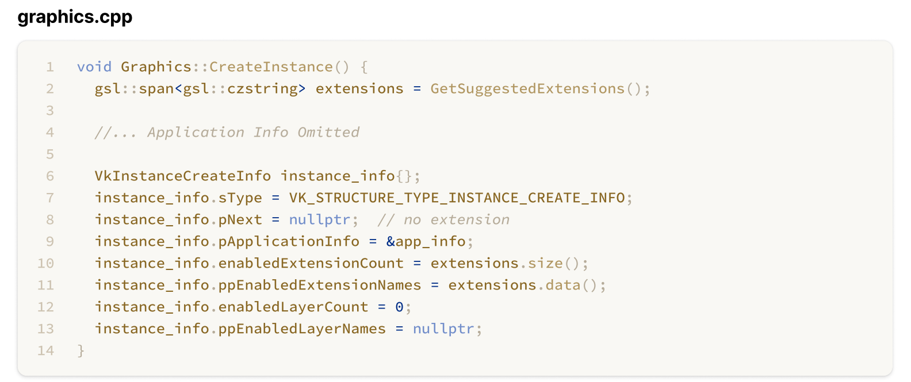

Now we have all the necessary elements to create a Vulkan instance. Don’t forget to add a function to check whether the instance was created successfully. This function will return a VkResult, which helps us diagnose problems more effectively than simply checking for a nullptr.

### Extension
#### Q1: what is the difference between the extension and the layer?
They are very similar but not exactly the same. Layers are functions that originally belong to the Vulkan API but do not run by default, whereas extensions are not part of the Vulkan API; they are added by developers to enhance Vulkan's performance. For example, we can see extensions like DLCs for a game.

At the beginning, we add two functions to graphics.h: GetSuggestedExtensions() and GetSupportedInstanceExtensions(). Notably, these should be written as static functions. Because they do not require any member variables and are used not only with VkInstance but also during the creation of VkInstance.

There is a typical solution for Vulkan to get the quantity and perporties for somethings:
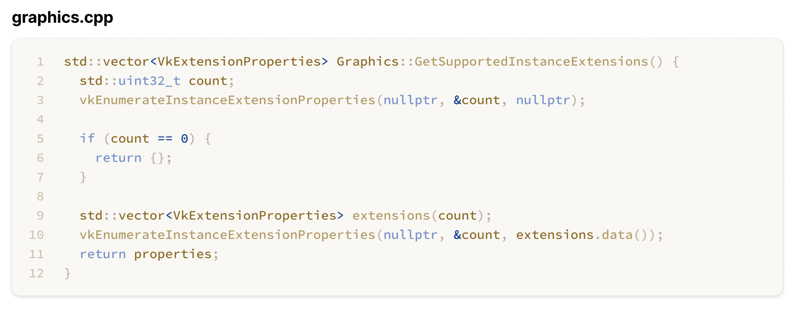

At first, we only obtain the quantity of content to determine the count. If the count is zero, we simply return an empty vector. Otherwise, we use the method again to retrieve the entire data. This approach allows us to clarify the size of the vector before inserting data, which saves space and reduces errors.

After that, we can further edit the CreateInstance() function, as illustrated in the graph below:
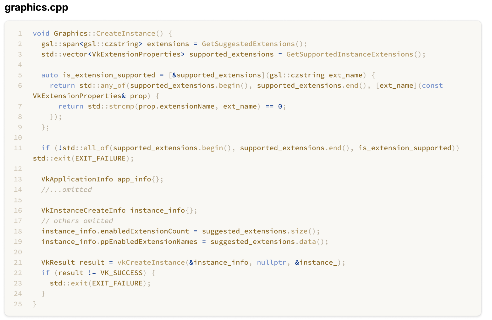

#### Utilities
If we consistently use a universal function, such as `streq`, to check whether two strings are equal, we can store these functions in a utilities file.

We can use this to refactor the extension check. Instead of checking if the extensions are suggested, we create function AreAllExtensionsSupported to determine whether the instance was created successfully, as shown below:
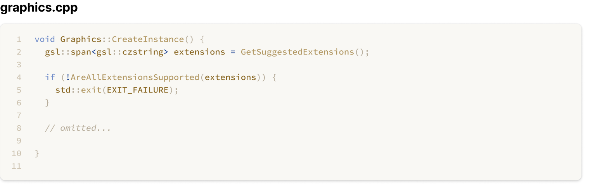

### Vaildation
Vaildation is a kind of layer used for comunication between Vulkan and developer. We can use different vaildation messages to help debuging our program.

Start with a boolean and use it in the constructor to decide when we use the vaildation.
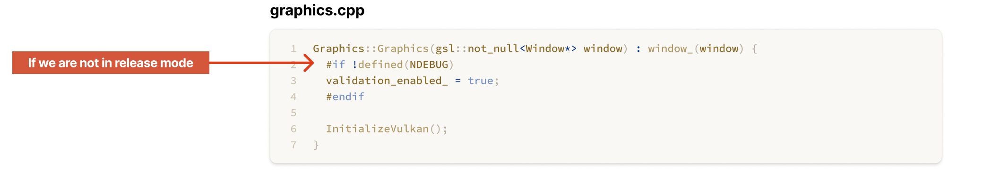
Because the error messages always have negative effect for performance, we only use them in the unrelease version.

Secondly, we need to add the vaildation extension, like this:
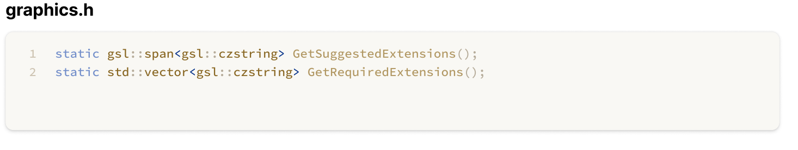

Then replace the extension with these new method.

After that, we can implement GetRequiredExtensions() in graphics.cpp, like this:
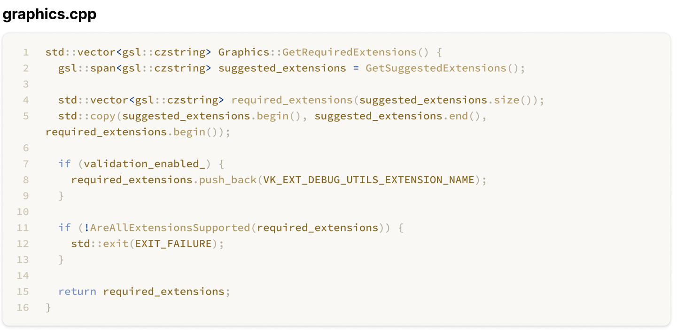

However, because we defined GetSuggestedExtensions() as a static function, which means it can not use the validation_enabled_ that is a non-static variable. As a result, we removed the  from the function.

Furthermore, we want to retrieve the layer properties, so we add GetSupportedValidationLayers() and AreAllLayersSupported into the graphics.h. We implement them in the .cpp file. They are similar to the extensions, so you may find it helpful to refer to that code.

Then, in CreateInstance(), we can manually add the Khronos Validation layer to the array and check if it is available for use.
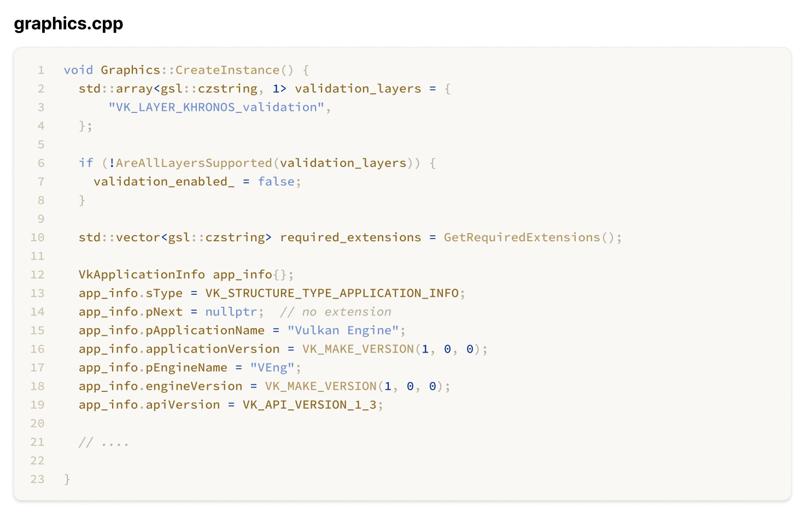

By controling the validation_enabled_, we can change the behavior of CreateInstance(). If it is a fause, we set the instance_info.enabledLayerCount = 0 and instance_info.ppEnabledLayerNames = nullptr. Otherwise, we input the quantity and data of layers into the app_info.

### Error handling

Once we have the validation layer, we need the messager to handle the messages. One of them is <iostream>. with it, we can create the callback mechanics of Vulkan:
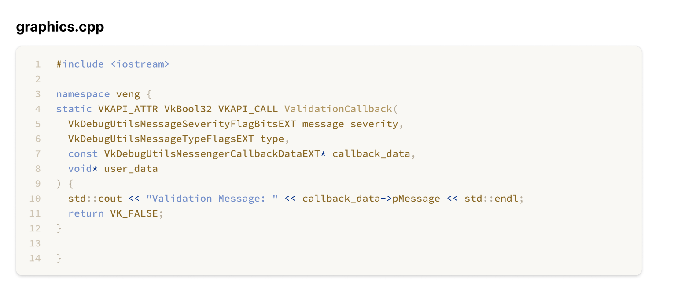
Now we are focusing on the VkDebugUtilsMessageSeverityFlagBitsEXT. The "EXT" here means extension, and this enum is a lable introduced by some extensions. You cannot use things like this before enabling certain lables.

We can also use a special signature to differentiate outputs based on their severity levels.
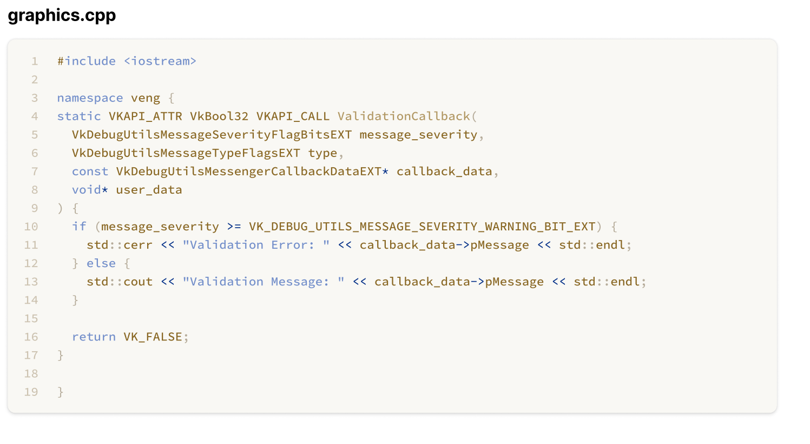

#### messager
To create a messager, we need another create_info, which means we need to fill a new form.

After that you can run the project and see the messages like this:
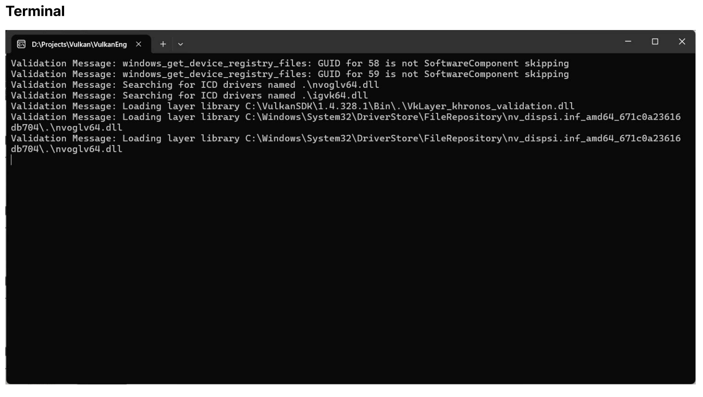

Moreover, we can use a different messager  it into the CMakeLists, then modify the create_info and validation callbacks. Now, the messages have different colors to help developers identify errors more easily.
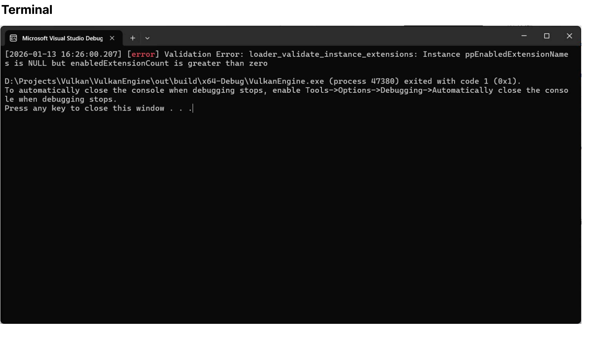

#### General Debug Messager
First, add a debug messenger to the graphics.h file and call this function when creating the instance. We need to implement our own vkCreateDebugUtilsMessengerEXT and use it in the SetupDebugMessenger(). If the messenger fails to be created successfully, it should not crash the app; instead, it will only print out a message.

The Messenger is used not only in the constructor but also in the destructor. Therefore, we need to create the vkDestroyDebugUtilsMessengerEXT function to verify whether the instance has been successfully destroyed.

Furthermore, we want to use spdlog with GLFW, so we create a glfw_error_callback to show the error messages from GLFW. Before the GLFW initialization, don't forget to call glfwSetErrorCallback(glfw_error_callback) so that when errors occur in GLFW, the glfw_error_callback function will be invoked to print the error messages.

### Device
Device is a necessart part for computer graphics. In this part, we consider three different things: physical device, logical device and the queue.

#### The Relationship between Them.
A physical device is a real device, meaning that all operations are performed by the physical hardware. A logical device can be viewed as a handle for physical devices; developers can only control physical devices through the logical device. A queue determines how to utilize the physical device to deal with the problem, it will arrange different task for different part of physical device. As a result, we use the logical device to control physical devices working in different queues, as illustrated in this picture:
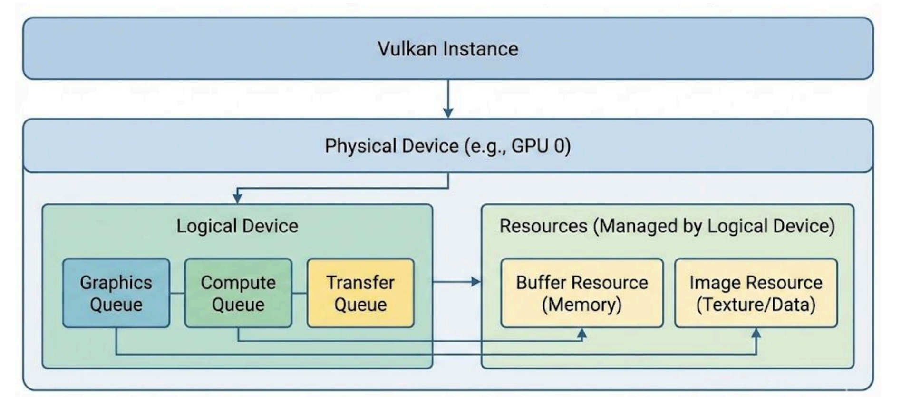

#### Physical Device
At the beginning, we need to identify the physical devices. We will use vkEnumeratePhysicalDevices to find all connected devices. Additionally, we will create three more functions to handle the physical devices:
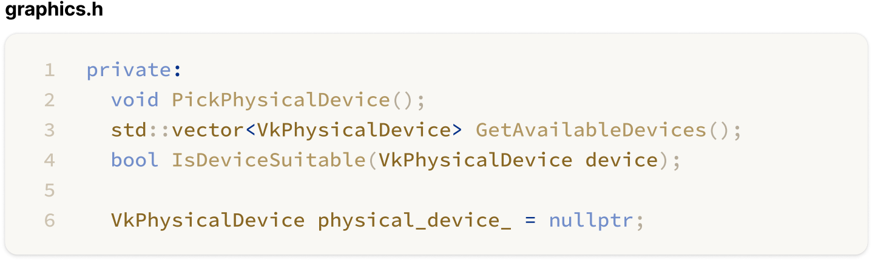

Remarkably, in GetAvailableDevices(), we use the same approach twice to list all the devices: the first time to get the count, and the second time to retrieve the data.

The function PickPhysicalDevice() is used to select suitable devices. It is clear that we need criteria to make this decision. Therefore, we use the IsDeviceSuitable to evaluate devices. Within IsDeviceSuitable, we can utilize the API functions vkGetPhysicalDeviceProperties() and vkGetPhysicalDeviceFeatures() for future requirements.

### Queue
A queue determines the order in which tasks are completed. Tasks are submitted to the queue and processed sequentially. Typically, a device has one or more queues depending on its capabilities. Queues can be divided into different queue families, which means they have similar functions and targets.

Because the physical device determines the number of devices, the capabilities of each family, and the number of queues belonging to each family, we can use vkGetPhysicalDeviceQueueFamilyProperties() to obtain this information.

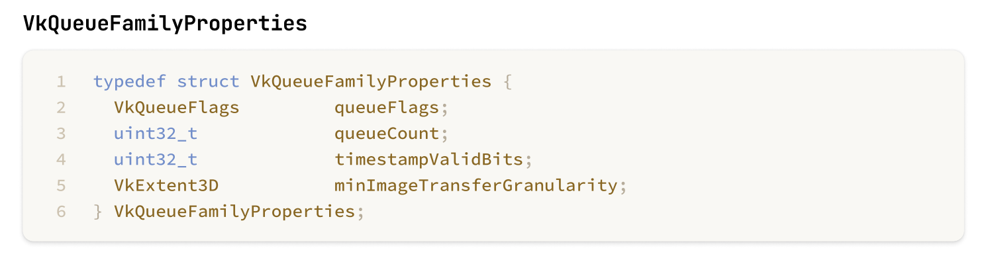
When considering queue family properties, we should focus on the VkQueueFlags. There are four different flags used frequently: VK_QUEUE_GRAPHICS_BIT, VK_QUEUE_COMPUTE_BIT, VK_QUEUE_TRANSFER_BIT and VK_QUEUE_SPARSE_BINDING_BIT. The first is used for drawing geometry, the second for dispatching compute shaders, the third for copying buffers and image contents, and the last for supporting memory binding operations. We can use them depending on the type of task.

To implement queues in our program, we first need to add a new struct and a new function to graphics.h. 
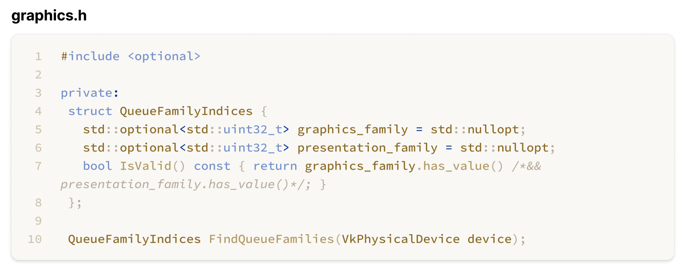

After Implement them, you can also use this function to renew your IsDeviceSuitable function.

### Logical Device
Logical devies can be seen as a agent and represents the initialized state of physical device. We create a logical device by vkCreatedevice():
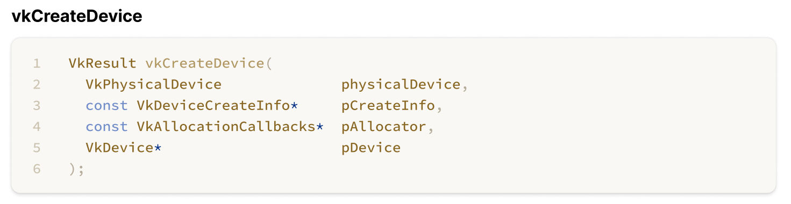
We can see a pCreateInfo we need to fill, which looks like this:
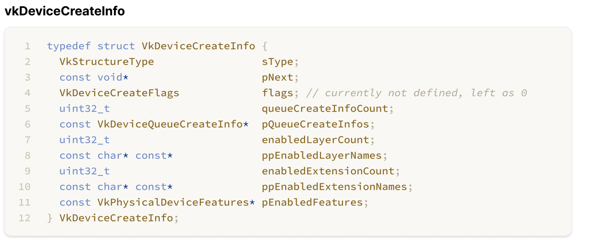
In this struct we can see pQueueCreateInfos, each one of them looks like this:
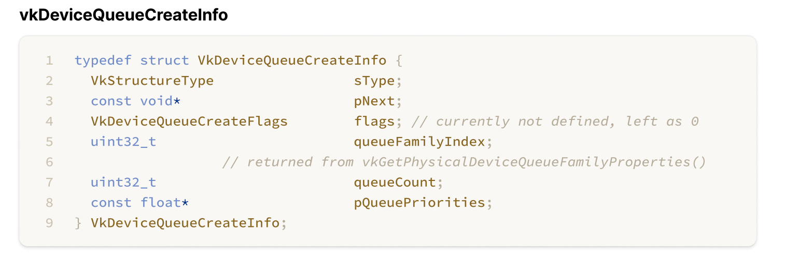
It's clear that to finish the function we need to finish two "forms" in it first. And the final function looks like this:
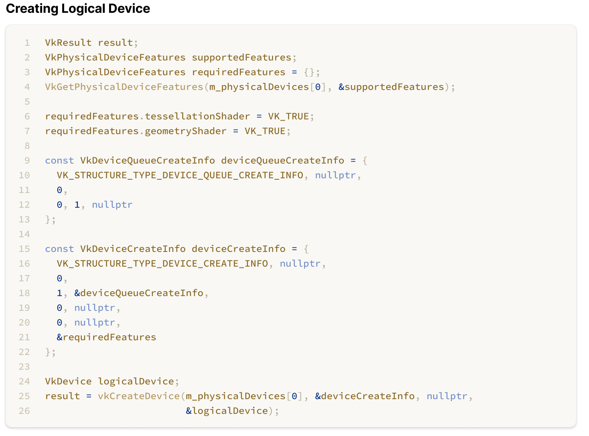

Now, let's incorporate them into the code. First, create a logical device handle and include it in the Vulkan initialization. This function will contain the process described in the previous paragraph. As we know, fill the vkDeviceQueueCreateInfo -> fill the vkDeviceCreateInfo -> implemant the vkCreateDevice. Also, remember to update the destructor to properly destroy the logical device.

Finally, we need to create the queue for our graphics. Here is a tip: when using Vulkan, you can use VK_NULL_HANDLE instead of nullptr to make the program more compatible with Vulkan. We can obtain the queue after creating the device. The code looks like this:
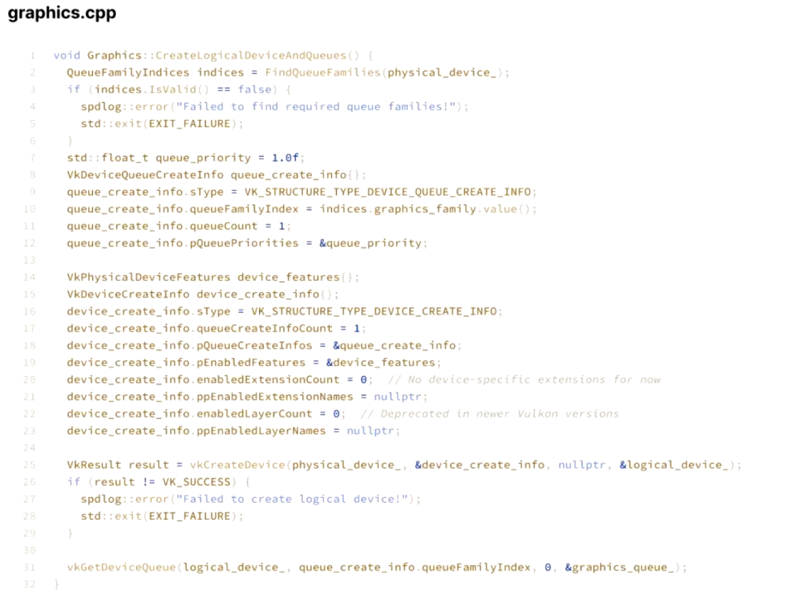

### Swap Chain
To understand the swap chain, we first need to understand what a graphics API is. Many people may think that a graphics API is used solely to draw images on the screen. However, this is a misconception. Drawing is not the core function of a graphics API; its primary role is to invoke hardware capabilities. Therefore, to present an image on the screen, additional handling is required. In our code, we need to create a presentation surface and use it during initialization, as shown below:
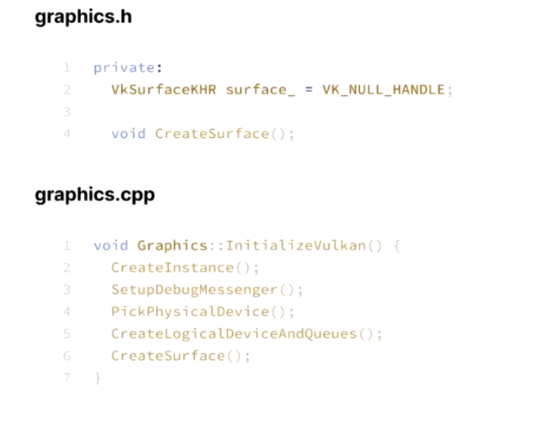
Remarkably, "KHR" indicates that this is not an original function in the Vulkan API.

Additionally, we need to update the destructor when adding it to the constructor. After that, we can update our QueueFamilyIndice to ensure that the queue family supports not only graphics capabilities but also presentation capabilities. Without a doubt, we should add a validation check because some graphics cards may not support presentation functionality. However, we need to change the initialization sequence because the surface does not exist when the queue uses it in our previous sequence. Don’t forget to implement the surface in the .cpp file and update the queue implementation code!

#### Q2:How do you draw two or more frames?
The most basic method is to generate and display images one by one. However, this approach often causes problems because the screen refreshes images line by line. As a result, multiple images may appear on the screen simultaneously, causing overlap.

The second method involves repeating the cycle of  can avoid overleap, but each time the image is deleted, it leaves a white screen, which can cause screen flickering. We do not prefer this method either.

The third method involves using two buffers to complete the task. While the monitor displays the first image, the second buffer prepares the next image, allowing for a smooth transition between the two. This approach can be applied in many other situations and is worth remembering and utilizing.

However, it also has some problems. If our GPU can generate images much faster than the monitor's refresh rate, it may cause a sense of tearing. To avoid this, we can synchronize the GPU's output rate with the monitor's refresh rate, meaning the GPU only pushes a new image when the monitor is refreshing. This technique is called 

VSync also has limitations. For instance, if the GPU's frame rate is slower than that of the monitor (e.g., 16.7 ms compared to 16.66 ms), the image will be displayed twice, causing the frame rate to drop to half the monitor's refresh rate. There are other issues as well; you can check the homework page for more details. As a result, we should use different strategies depending on the specific hardware situation.

