# Week 13 Notes
This week we continue learning how to create a pipeline in Vulkan.

## Device-independent
Last week, we emphasized that SPIR-V is device-independent, but we did not explain why this is the case. The primary reason is that different graphics cards may use different coding schemes for their video memory. As a result, the GPU driver is necessary to determine the actual location of resources, allowing our program to adapt to any type of GPU. This concept is called "decouplling", which is a common method in the field.

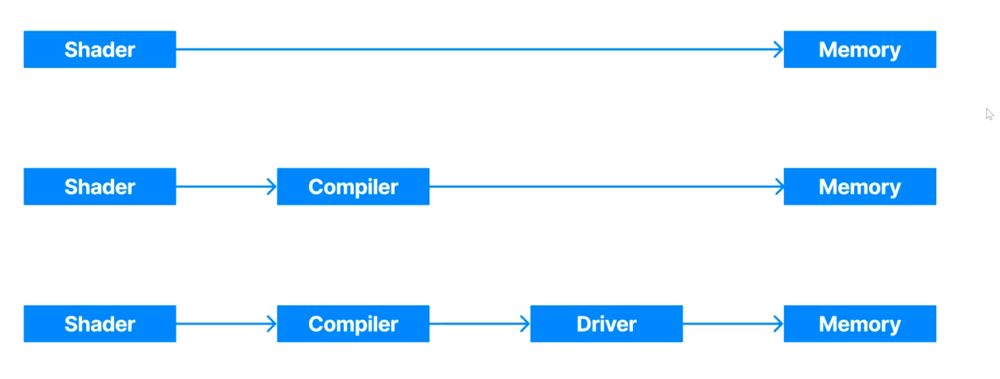

This graph shows how to split processes into different parts managed by various roles. Finally, the shader sends tasks to the compiler, the compiler calls the GPU driver, and the GPU driver confirms and locates resources from physical memory.

In other words, especially during the development period, shader crashes and GPU changes are common. However, we do not want these issues to directly affect physical memory, as that could cause significant damage to our device.

## Shader Module
Once we finish a SPIR-V module, we want to hand it to the Vulkan so that a shader module object can be create from that. 

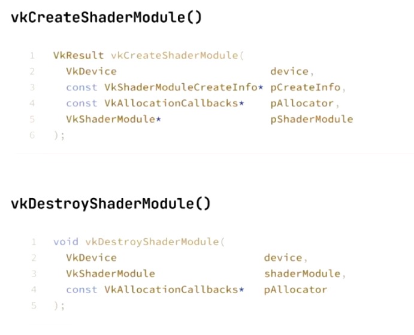

Here is how we create and destroy a shader module. Most aspects are similar to other parts of Vulkan; nothing special.

A shader module is used to create shaders. It is similar to a script for a play. When you want to perform the play, you refer to the script to prepare, but the actual performance is independent of the script. Therefore, once we have successfully created the shader and are certain it will not be created again, we can destroy the shader module because it will no longer be needed.

## Compute Pipeline
The compute pipeline is another important use of a graphics card. In computer graphics, the graphics pipeline is the primary component. However, in artificial intelligence, the compute pipeline plays a crucial role because it can perform a massive number of simple calculations simultaneously, thanks to the powerful parallel computing capabilities of GPUs. The main difference between the graphics pipeline and the compute pipeline is that the compute pipeline does not consider the presentation stage; therefore, it does not have a vertex shader to transform vertex addresses. In fact, the compute pipeline does not operate on the concepts of vertices or projection. Its sole function is to process data.

### Core concept 1: 3D Layout
In Vulkan, the compute pipeline is divided into a 3D layout (x, y, and z). This structure helps Vulkan distribute work across different threads. Workgroups represent the smallest units when dispatching work. Each workgroup contains multiple invocations—the term used to refer to threads in software development.

### Core concept 2: Dispatch and Indexing / Global vs Local
When we dispatch the work, we can confirm the number of workgroups through the local size. For instance, you need to process a 2D texture and the size of it is (1024\*1024) and the local size for x and y is 16, the number of group will be (1024/16, 1024/16,1).

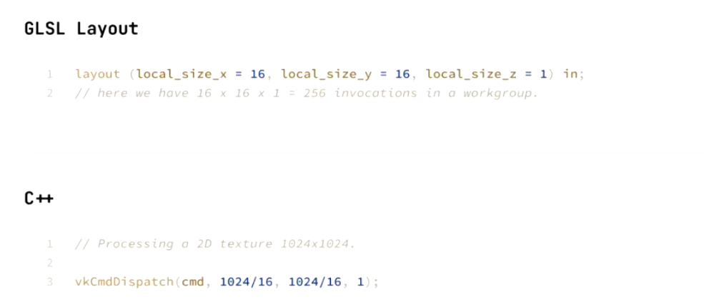

### Core concept 3: Shared Memory
All the workgroups share the SSBO/Image, which is slow for reading and writing, but every workgroup can access it.

Once a memory is tagged with "share", this memory will be shared for all invacations in the single workgroup. It is fast for reading and writing but private.

### Core concept 4: Barrier
It will be explain further in future.

### Core concept 5: No Render Pass Required
For the compute pipeline, we can read resources directly from an image or buffer and write them directly into an image or buffer.

Creating a compute pipeline is similar to creating a graphics pipeline, but it is simpler.

The compute pipeline plays a crucial role in creating special effects in computer graphics. For example, when simulating wave effects on a water surface, it is impractical to recalculate all the triangles of the water mesh every frame. Instead, we can generate a normal map that modifies the normals of certain triangles dynamically each frame. Rather than rendering this directly to the screen, we send the data to the compute pipeline to calculate the accurate normal map for the current frame.

## Resource Access
In this section, we will talk about how shader accesses the resources.

### Descriptor Set
"Descriptor" actually is the resource, so descriptor set means resource set. We can see the structure in the graph below:

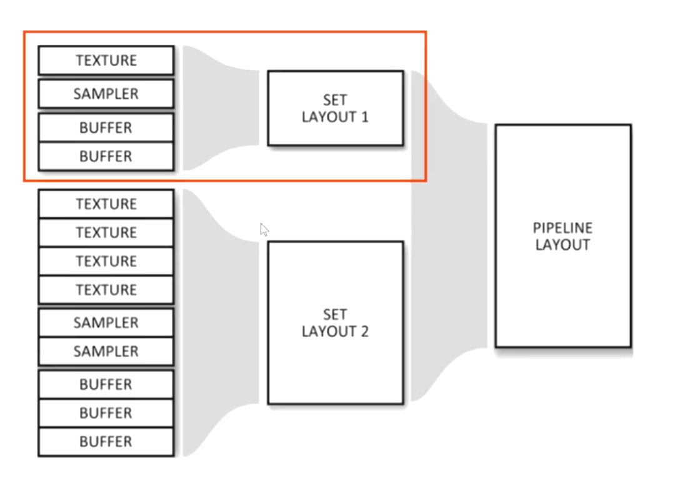

In this graph, you can see that set layout one contains a texture, a sampler, and two buffers. This means that once you use this set, it will require these resources without any changes. There is also a pipeline layout, which determines how many and what kinds of sets will be used in this pipeline. In fact, we use set layouts to create sets, and we use pipeline layouts to create pipelines, but what we actually use are sets and pipelines. We can use the same layout to create different sets.instances, which we can understand through the graph below:

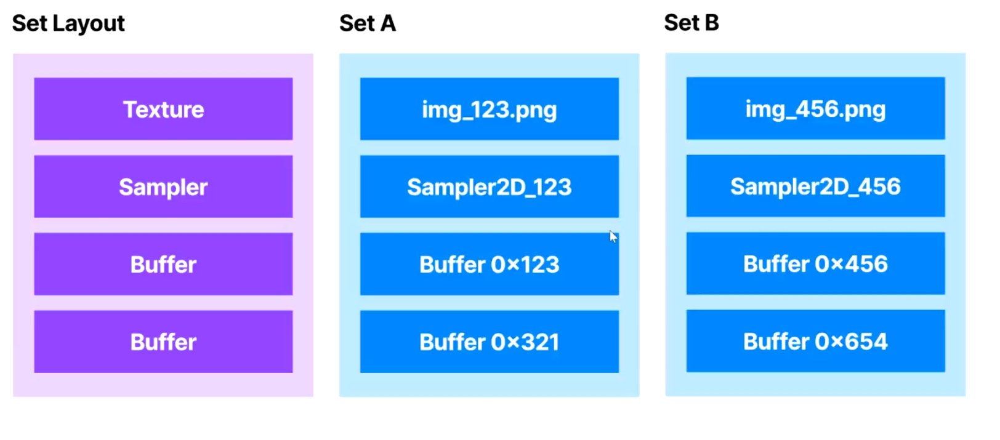

It is clear that although set A and set B have the same structure, they are completely different instances.

Finally, we combine the descriptor set with the command buffer, which enables the creation of a draw call. Remember, in this process, we must bind the set itself rather than the set layout—similar to needing a house instead of just the blueprint. What the command buffer actually requires is the set that corresponds to the set layout. In other words, we can easily switch the binding from set A to set B because they use the same set layout.

Now it's time to learn how to create a descriptor set layout. In general, we need vkCreateDescriptorSetLayout() in Vulkan.

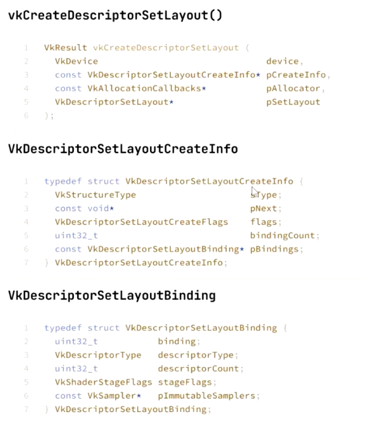

Here, you can see that we need a creatinfo, in createinfo, there are two special element: pBindings and bindingCount, which are used to specify where resources are bound and to count the number of resources, respectively. Each resource has a binding number, which will be placed on binding in VkDescriptorSetLayoutBinding(). Honestly, Vulkan allows you to use non-contiguous binding numbers, it is not recommended because it may increase the memory footprint of the program.

Another important element is VkDescriptorType, which specifies the type of descriptor. Common types include VK_DESCRIPTOR_TYPE_SAMPLER, VK_DESCRIPTOR_TYPE_IMAGE, VK_DESCRIPTOR_TYPE_UNIFORM_TEXEL_BUFFER .etc.

Samilarly, we can create a pipeline layout through vkPipelineLayout().

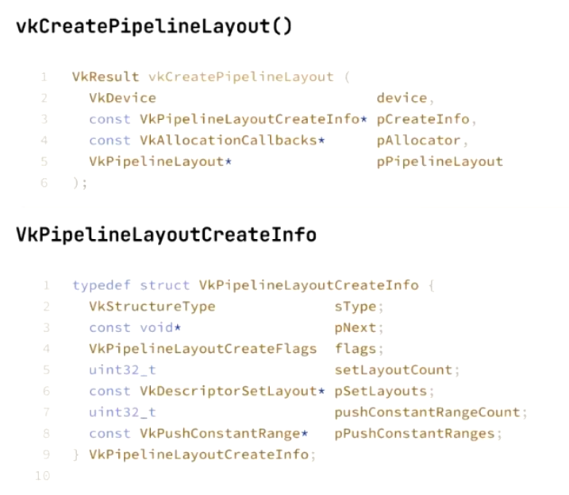

Here are two special things in its createinfo: pushConstantRangeCount and pushConstantRanges, They point out to the same thing: push constant.

#### push constant
In general, a push constant is a small region within the command buffer. It can store only a few resources, but shaders can access these resources very quickly. It has several important properties that we should understand:

First, it can be divided into different ranges. We can set the offset value to define each range, and these ranges can be used for different steps. For example, we can set offset = 0, 16 bytes for the vertex shader, and offset = 16, 16 bytes for the fragment shader.

Second, its life cycle is independent of the descriptor set. Moreover, until Vulkan actually draws something, there is no error message if you use an unacceptable pair. When Vulkan draws something, it checks whether the push constant matches the pipeline layout and only draws when they match. Sometimes, even if you declare the usage of a push constant but do not use it as you say, that will be allowed.

Finally, you can change a portion of a range instead of modifying the entire range or the whole push constant, which makes it more convenient to update resources.

### Declare Resources in GLSL
We use a lambert diffiuse fragment shader as an example:

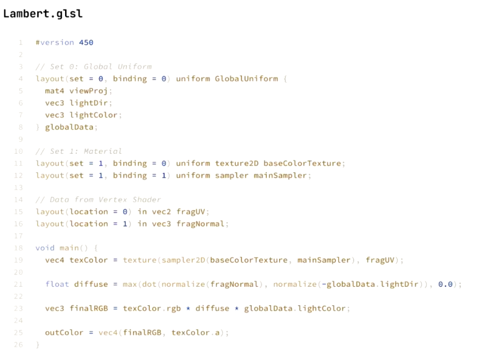

For set 0, we always include global uniform data. In this example, we place the view projection, light direction, and light color into the global data because these values remain constant throughout the pipeline process.

For set 1, we place materials into it. In this example, we assign a texture2D as our baseColorTexture at binding 0 and a sampler at binding 1. Remember, this pair always appears together, which means if you add a texture2D, you must also add a sampler.

Next, we need some data from the vertex shader or another source. In this example, we obtain the fragments' UV coordinates and normals from the vertex shader, which are necessary for the following calculations.

Finally, in the main function, we calculate the color using the data obtained from the previous steps.

Usually, we place the shadow map and G-buffer in set 1, and materials in set 2. Furthermore, objects are placed in set 3. We can use the update frequency to distinguish them: in set 0, everything changes every frame; in set 1, everything changes every pass; in set 2, everything changes per material; and in set 3, everything changes per object.

Remember to use a continuous binding number. The keyword "uniform" indicates that this data will not change during the draw call.

### How to Create A pipeline?
There are three main step: layout, set and update. Here is an example:

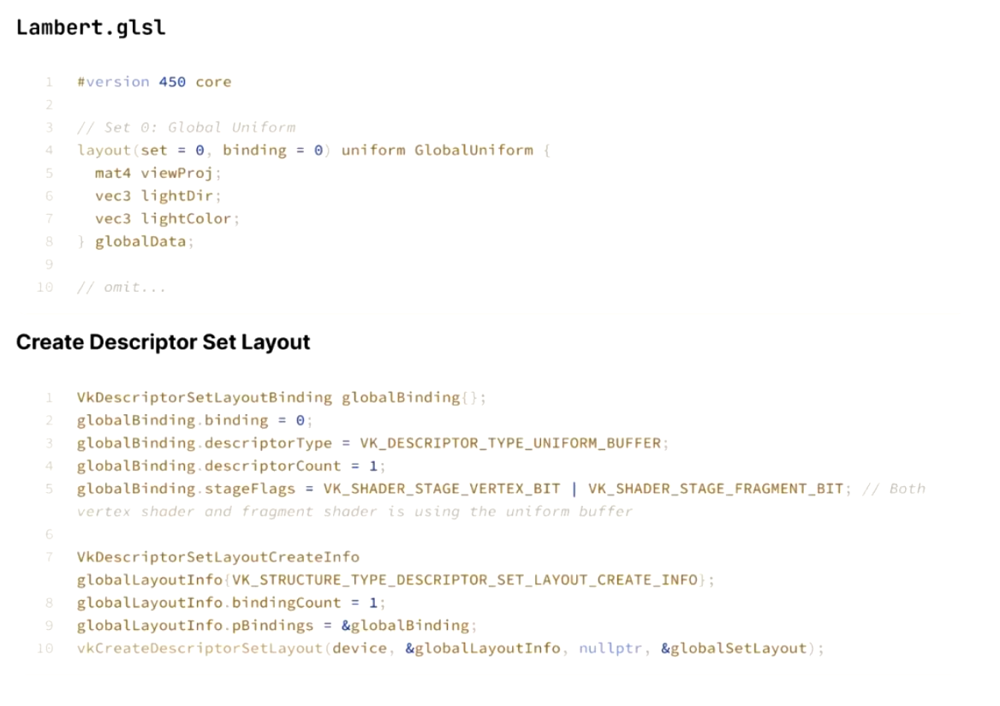

This graph shows how to create descriptor set layout for set 0 (GolbalUniform).

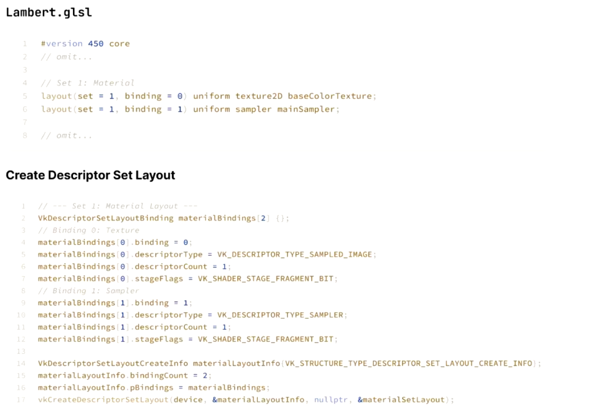

This diagram illustrates how to create a descriptor set layout for set 1. Although there are many lines of code, they clearly demonstrate what is required based on the previous example.

After layout step, we conduct the set step:

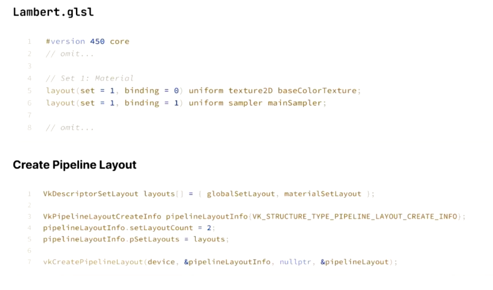

Finally, we finish the update step:

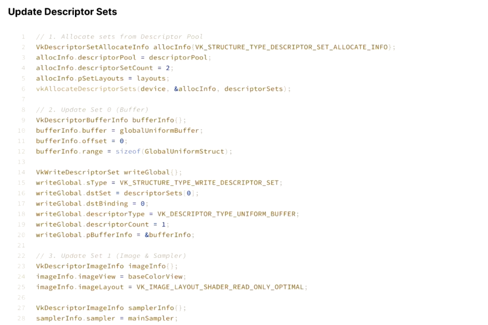
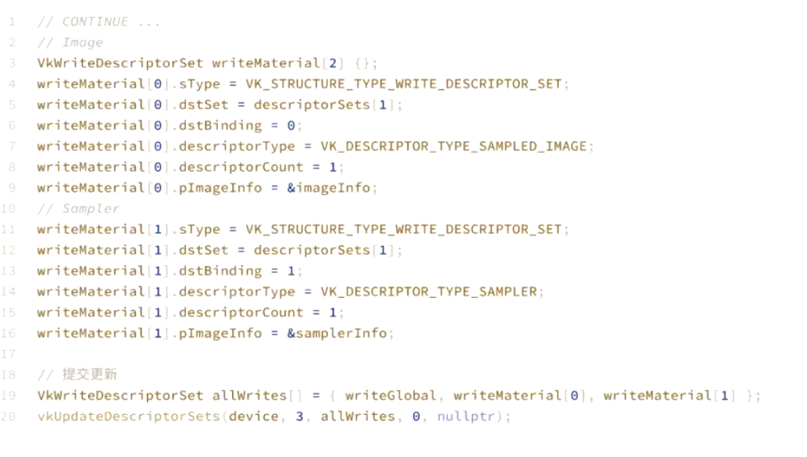

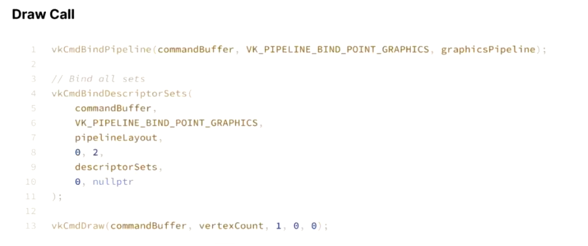

#### limitation
The number of resources is limited. To assist users, Vulkan guarantees a minimum maximum number of descriptors. For example, Vulkan ensures that the maximum number of descriptors is at least 96 if your device supports Vulkan successfully. If you use more descriptors than this guaranteed minimum, it is advisable to check your device's capabilities and prepare to handle potential failures gracefully.

#### Destory
After using, don't forget destory the pipeline layout and decriptor set layout.

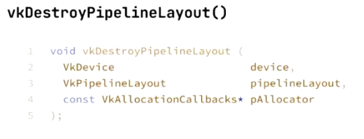
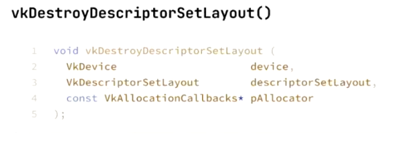

### Descriptor
Where we get the descriptor? In Vulkan, descriptors are allocated from a descriptor pool.

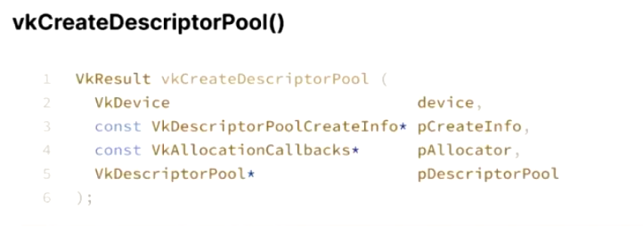
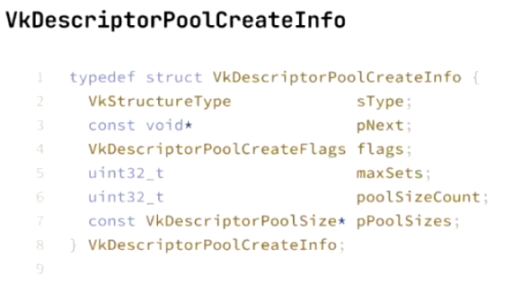

In general, Vulkan allocates memory from the GPU before you use it. Vulkan may reserve a 2GB memory pool and divide it into multiple segments, providing you with an appropriately sized segment when you need memory to store descriptors. You cannot store descriptors that exceed the size of the allocated segment. This approach has two advantages: first, it simplifies tracking how much memory is used and how much is available; second, it reduces the overhead of repeatedly requesting and releasing memory from the physical device.

Once a pool has been successfully created, we need to allocate the descriptor set.

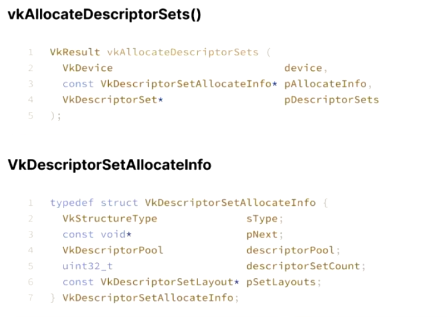

After finishing using them, we need to call release function to return the memory to the pool.

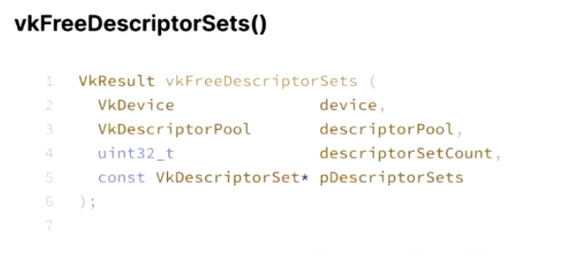

For descriptor set you get, you need to conbine it to the command buffer.

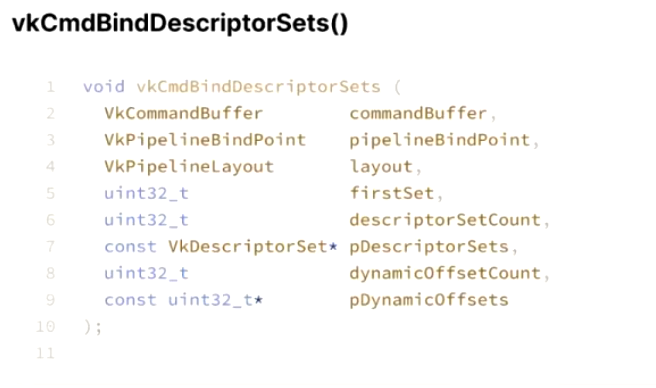

## Get into Resources
### Uniform, Texel and Storage Buffers
Shaders can directly access buffer memory through three types of resources: uniform blocks, shader storage blocks, and texel buffers. Uniform blocks provide fast access to resources but are read-only. Shader storage blocks allow both reading and writing of resources. Texel buffers are used to read image data. The choice of which to use depends on how you need to access the resources and should be adapted to different situations. Below is how to declare them in GLSL:

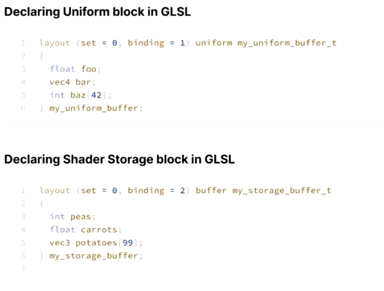
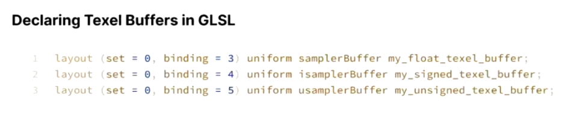

Remember, using the "uniform" keyword creates a uniform block, while using the "buffer" keyword creates a shader storage block.

There are three types of texel buffers: samplerBuffer, isamplerBuffer (integer), and usamplerBuffer (unsigned integer). Texel buffers can be used to perform fast format conversion when reading data.
