# Week 12 Notes
In this week, we will continue to learn how to create a pipeline in Vulkan.

## Part one: Renderpass
Renderpass and pipeline are parallel concepts, and neither contains the other. Simply, you can distinguish them as pipeline is used for “how to draw” and renderpass is used for “where to draw”. For example, pipeline likes how you decied to draw an oil painting, and Renderpass likes where you want to draw, what type of canvas you will use.

We can see what it looks like in the Vulkan:

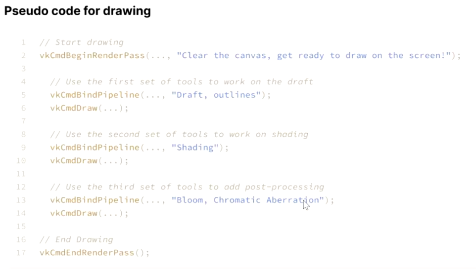

You can see that the vkCmdBeginRenderPass and the vkCmdEndRenderPass wrap the renderpass code. Inside it, here are three vkCmdBindPipeline and vkCmdDraw, which means in this render pass it use three different renders to draw the image on the screen. These three render can also be called subpasses. As a result, there is a renderpass with three subpasses.

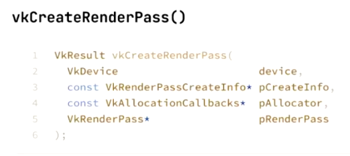

We can see how to create a renderpass in Vulkan. Remember, although they are parallel concepts, you must create renderpass before you create your pipeline as the squence of the createinfo. To understand it is easy – before you buy your tools (pipeline), you need to know what canvas you will use.

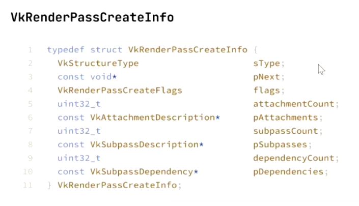

Here is the createinfo for renderpass. We can see three important concepts: attachment, subpass, and dependency.

### attachment

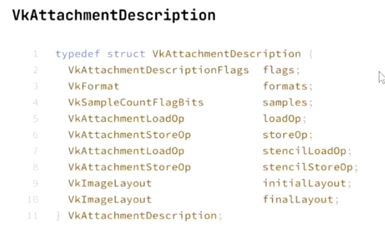

Attachment is used to determine resource specs. We can decide the format (colors: RBGA8 / single color: R8_UNORM). We can decide samples (one sample per pixel (1x) / 4 samples per pixel (4xMSAA) ). We can also decide the loadop (always a clean canvas (CLEAR) / canvas with things (LOAD) / don’t care (DONT_CARE)). The fourth thing is storeop (save (STORE) / don’t care (DONT_CARE)). The next is the initial layout (paper in a roll (Undefined) / flat (ColorAttachment)). The last one is the final layout (save for next process (TransferSrc) / display (Present)).

### subpass

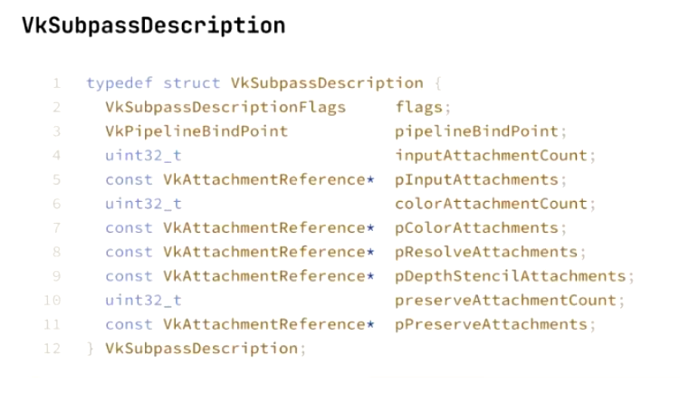

In each subpass, you can have multiple input attachments and color attachments, which are used to determine where you read data in and where you write data to. However, you can only have one Depth-Stencil attachment, which determines where it is used as a depth/stencil buffer.

Remember, the input attachments and color attachments are decided by your physical device, so you can get them through vkGetPhysicalDeviceProperty.

### dependency

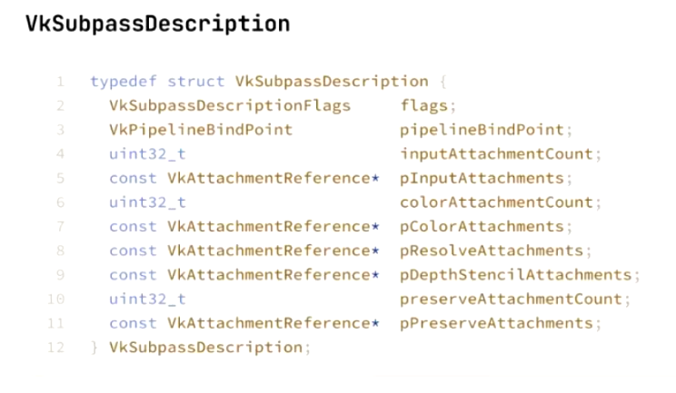

Dependencies determine the sequence between subpasses. As we know, some subpasses work based on the previous subpasses’ outcome. However, GPUs work parallelly therefore wo need to discribe the order specifically to ensure the subpusses work correctly.

## Part two: Frame Buffer

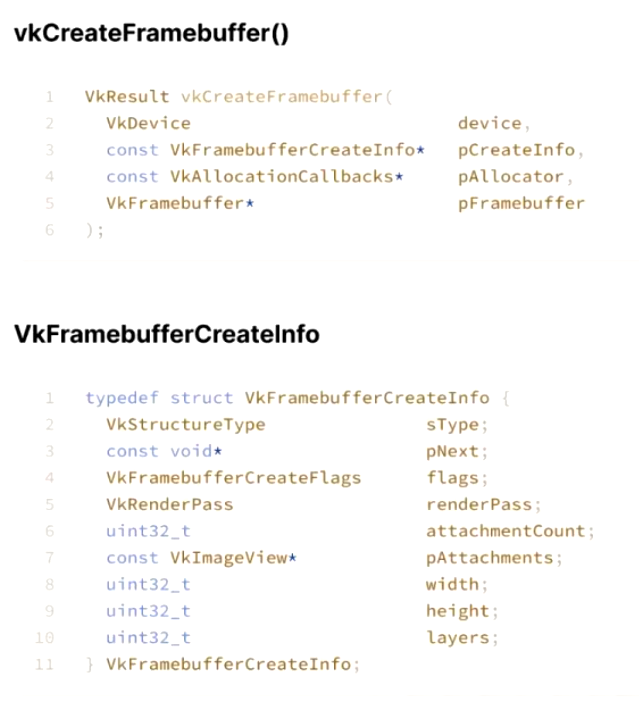

You can see what you need to create a frame buffer. There is an important thing in createinfo, which is that we will use a VkImageView to store the pAttachments. View means a way to understand the data. As we know, an image is a structure to store the data, so view decide how we understand this structure. Sometimes we only need to read the image in one process and write it in another process, which means we need two different views to understand the image.

Another critical thing is that although there are height and width in the view, we also need to define the width and height in createinfo. In most time it will be the same with them in the view. Moreover, they are device-specific, which means they depend on the function of the physical device.

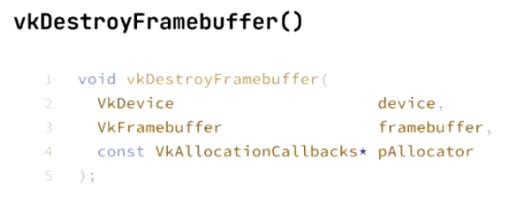

Last, don’t forget to destroy the frame buffer after using it.

## Part three: Create A Graphics Pipeline
First of all, call vkCreateGraphicsPipelines to create a graphics pipeline.

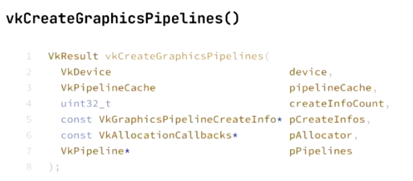

Excluding the createinfo, there are still three important things. The first one is the pipeline cache, which can be understood as a blueprint of the pipeline. When we need to create multiple same pipelines, it will be helpful to quickly build many same pipelnes. The second thing is VkPipeline, which means a pipeline state object. PSO is very important and we can change the pipelines we use by changing the PSO. It is also an expensive process for the GPU, so we should reduce the switch time to enhance the performance. The last one is CmdBindPipeline, which is used to change to another built pipeline.

Here is the createinfo for creating a pipeline:

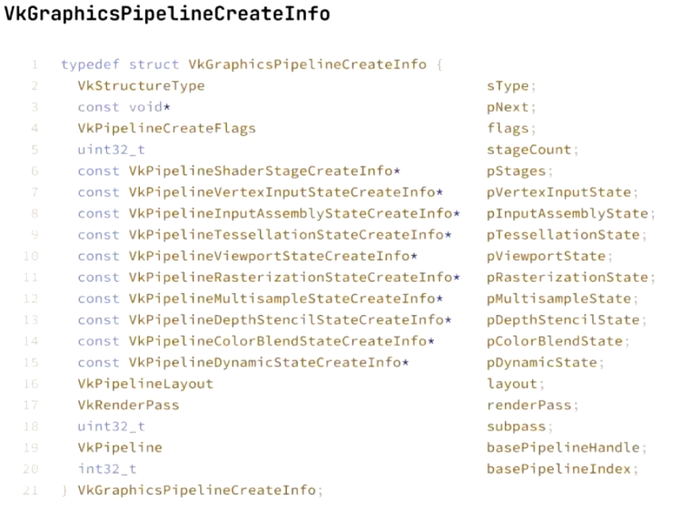

Although it is massive, we can see many familiar things we learned last week in this createinfo. Also, as we said in the last lecture, except for the vertex shader, everything can be a nullptr.

There are many kinds of flags. The flag is used to describe how to use this pipeline. The first flag is VK_ PIPELINE_CREATE_DISABLE_OPTIMIZATION_BIT. This flag means this pipeline can be used without high performanced device and this pipeline will be fast. It is useful when you need to create a prototype sinse although this pipeline do not have a high effect, it is fast and easy to test.

Another two are vk_pipeline_create(\_ALLOW)\_DERIVATIVE(S)\_BIT. They are used to pack some samilar pipeline to make the PSO switch fast. In most time, we can use vk_pipeline_create_ALLOW_DERIVATIVES_BIT directly.

stageCount and pStages are used to store the shaders. Since we must have a vertex shader, stageCount at least is one, and there is at least one shader in the pStages. Moreover, the vertex shader will always be the first one in pStages. After it are hull shader, domain shader, and fragment shader.

Here is a shader stage create info:

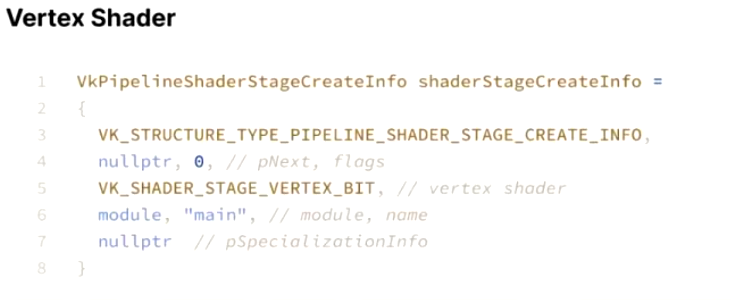

We focus on the fifth line, here are five different bits: VK_SHADER_STAGE_VERTEX_BIT, VK_SHADER_STAGE_TESSELLATION_CONTROL_BIT, VK_SHADER_STAGE_TESSELLATION_EVALUATION_BIT, VK_SHADER_STAGE_GEOMETRY_BIT, and VK_SHADER_STAGE_FRAGMENT_BIT. They correspond to five types of shaders.

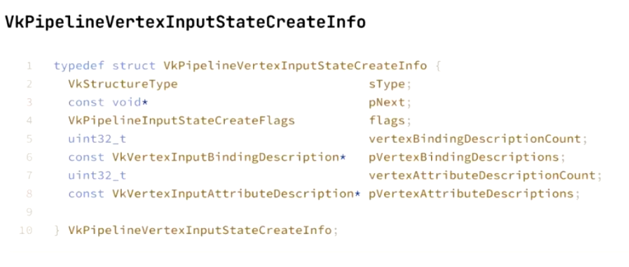

Vertex input state is used in the application stage to get data from the command buffer and determine the layout.

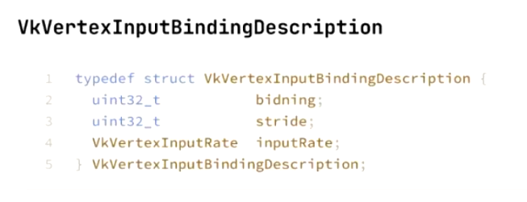

The vertex input binding description is used to bind data. From this, we can understand how to split this data. Stride means the feet size of the data. Binding means the socket index of binding. We can store all data in a single socket or in many different sockets. For instance, if we have one socket, the position and color of each vertex are stored, we need to clearify the stride to ensure we get all position and all the colors correctly. On the other hand, we can have two different sockets, one for color and one for position. There is no advantages between these ways, we just need to make sure how the data is stored. The maximum number of bindings is 16, unless you have some special device.

Another thing is the input rate, which decides to use data per vertex or per instance.

The next step is vertex input assembly:

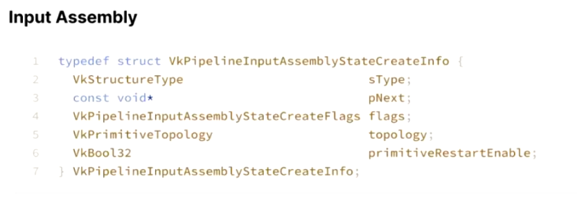

This step is used to assemble all the data. We concentrate on the topology; there are six different kinds. We can understand them from the graph:

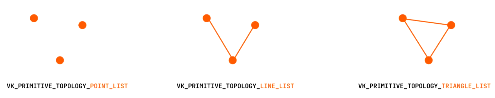
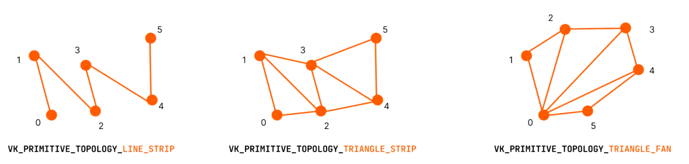

After this, most things in the pipeline are explained. Other things can be found in the API. We should be familiar with this process from now on. 

## Shader in Vulkan

### SPIR-V
SPIR-V is the only shader language that Vulkan can understand. However, we do not need to write it directly; we should write the GLSL with a #version [n] at the front, like this:

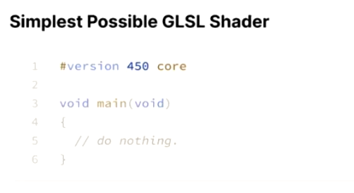

#version [n] confirms the version of Vulkan we use. If the device cannot accept this version, the code will not run. After that, the compiler will help us to convert the GLSL to SPIR-V, which is why we do not need to write it.

SPIR-V is short for Standard Portable Intermediate Representation - Generation V. In SPIR-V, it is split into different modules, each modules have multiple shaders. These shaders have different names and stages (vertex/fragment/…).

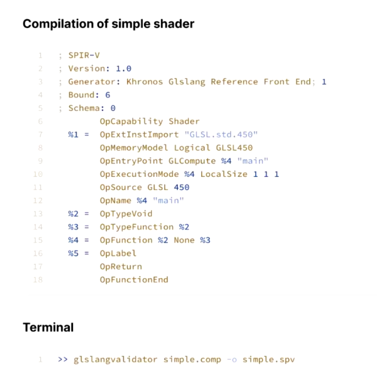

Here is an example of SPIR-V. We can see some important things in it. The first one is OpCaoability, which confirms the function of this code. In this example, it’s a shader. The second one is OpMemoryModel, which confirms the logical model of this model. The last one is the OpEntryPoint, which confirms where is the entry of this shader is. In this example, Vulkan should start from main, which is defined in %4.

Remember, all SPIR-V is written in Single Static Assignment(SSA), which means once they are assigned, they cannot be changed.

Now we can see another example:
Here is what we write in GLSL:

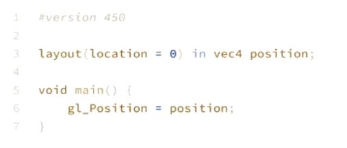

And the SPIR-V that converts from the GLSL:

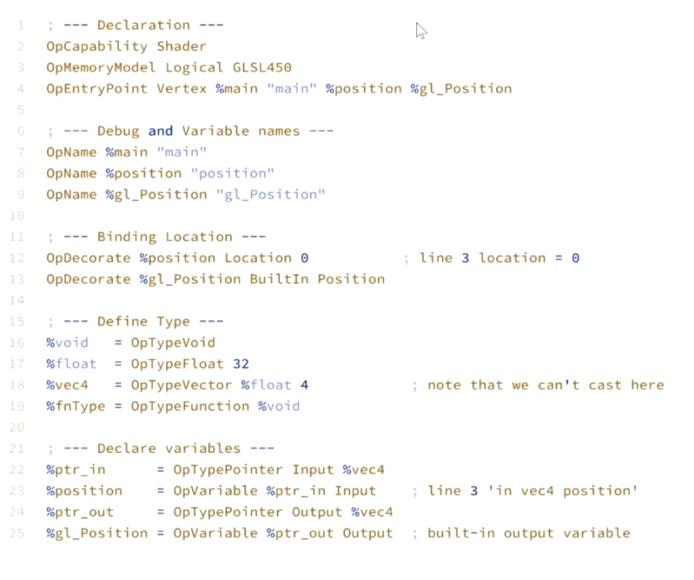
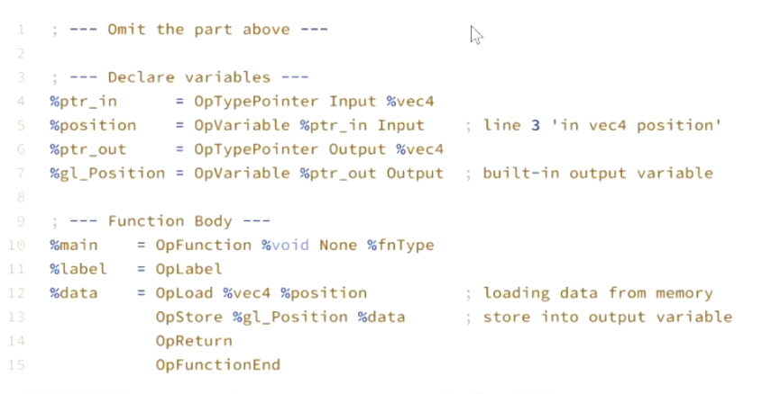

Notably, SPIR-V is device-independent, which means it cannot read or change the real physical addresses in the device; it can only read and change through the logical addresses. We can use ID and Decoration to represent the address.
