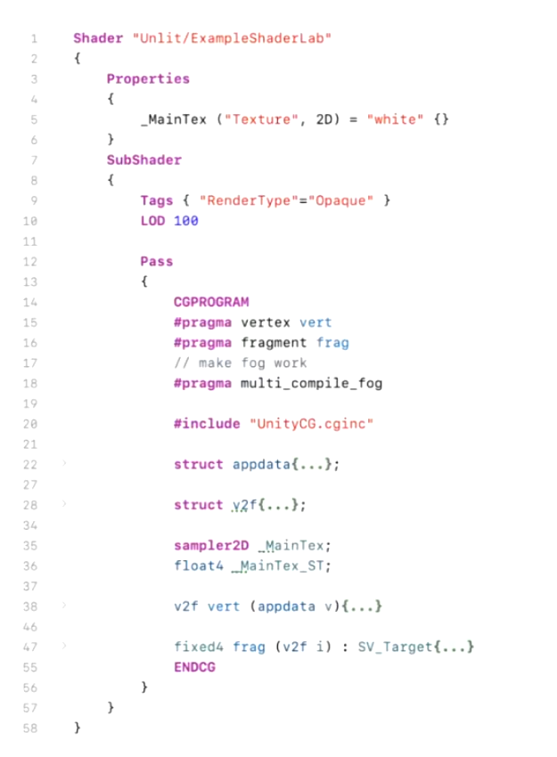
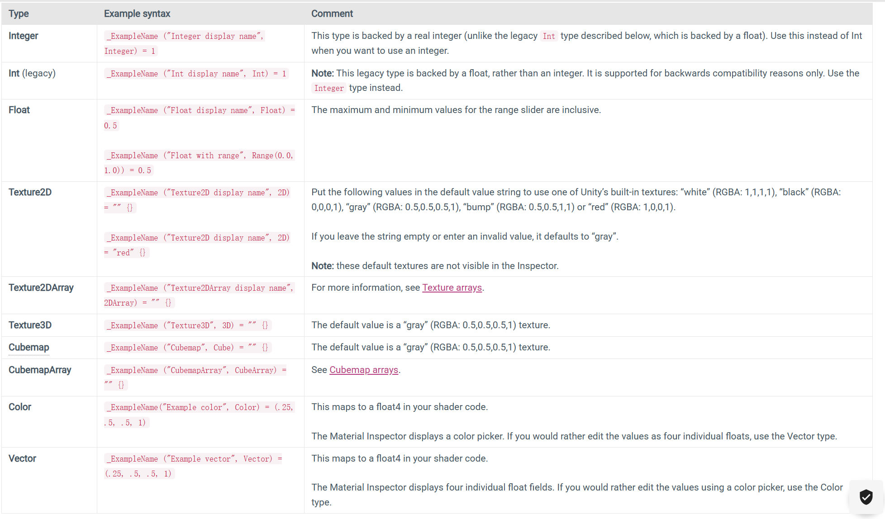
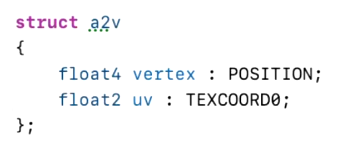
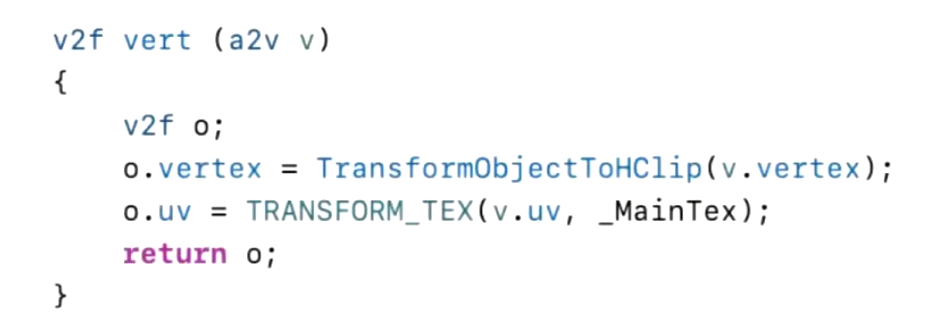
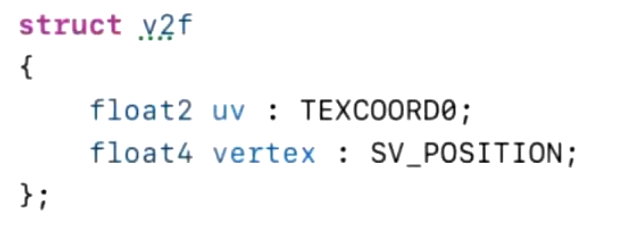
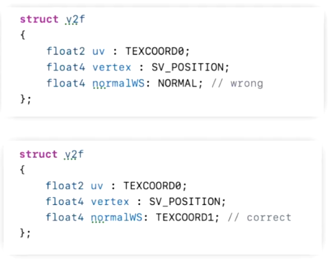
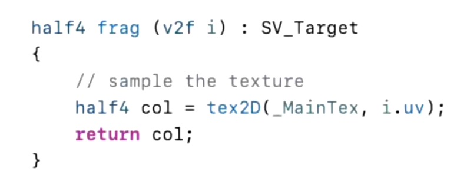

### Week 4 Notes

This week we will focus on the HLSL (High-Level Shading Language), which is used to program the shader. 

## Part 1: Basic Syntax
We have learned how the rendering pipeline works, step by step. From now on, we can remember some basic syntax of HLSL. HLSL is very similar to the C language; as a result, some syntax elements like bool, int, and float are the same as the function and feature of them in C language (however, you do not need to add an "f" to the back of the float number). Moreover, we encounter types such as half, float2/3/4, and float$4\times4$ are appeared in HLSL. The half type represents half-precision floating-point numbers and is commonly used to store color values (e.g., half4). The float2, float3, and float4 types represent 2D, 3D, and 4D vectors, respectively, while float$4\times4$ denotes a 4-by-4 matrix. These are the most common types used when creating shaders. Next, we will examine the various components of a shader and their structure.

Here is a basic framework of a ShaderLab script. I will describe each part of it after this paragraph.

The first line of the ShaderLab script declares the name of the shader. For example, if we create a ulint shader in the unity and name it "ExampleShaderLab", the first line should be "Shader Ulint/ExampleShaderLab".

In the highest level of declaration, we need to construct two subparts. First one is "Properties". In this part, we should declare all the variables. An example is shown in this picture: "\_MainTex ("Texture", 2D) = "white" {} ". "\_MainTex" at here means the name of the variable, which will be used in the program. Note that all variable names should begin with a "\_", and the first letter of each word should be capitalized, with no spaces between words. "Texture" is the name which will appear in the inspector. "2D" indicates that the variable type is Texture2D. It is important to note that the type name used here may differ from its actual type name. The correspondence between them is as follows:

The right side of the equal sign represents the default value of this variable. In this example, the default value is white, so this variable is a 2D texture with white as the default color.

The second part is "SubShader". A ShaderLab file can contain multiple subshaders. This section determines which subshader should be used based on the GPU's capabilities. The first line within the subshader is "Tags", which instructs the system on which tools to invoke, such as a specific render pipeline type. Following that is the "LOD" (Level Of Details). This specifies the precision of the shader and is useful because not all objects in a scene need to be described with the same level of detail, especially when they are at varying distances from the camera.

The third part of the subshader is "pass". It begins with "HLSLPROGRAM" and ends with  the "ENDHLSL". Although in the picture we used the CG language, it is easy to switch from CG to the HLSL. Importantly, if you declare a variable in the properties block, you must also declare it again in the HLSL code. In this example, we need to declare a Sampler2D in HLSL (note that the variable type may differ between the properties and HLSL). Next, we will focus on how the HLSL finish the work with a rendering pipeline.

The first struct is a2v (application to vertex). This struct is used to send data from the application to the GPU and to identify the vertex data. An example is shown below:

Because the data sent from the application consists of just raw bytes, we need a description to help the GPU recognize the meaning of the data. For example, we name a float4 vertex POSITION, so the GPU understands that this part of the data represents the position of a vertex. The next part of the data is the UV coordinate of this vertex with the name "TEXCOORD0", and the length of this part should be the length of float2. There are many keywords that can be used, including POSITION, TEXCOORD0–15 (note that you cannot set more than 16 TEXCOORDs), NORMAL, COLOR, and so on. Once this structure is complete, the application stage of the pipeline is finished.

Now we can move on to the vertex stage. In the pass you can see the "#pragma vertex vert", which specifies the vertex shader function. Refer to the image below:

We can see that the output data structure is v2f (vertex to fragment), and the input is a2v. In this function, a v2f variable named o is defined, and its vertex is set by transforming the vertex from v into clip space. Then, the UV coordinates from v are transformed and assigned to \_MainTex. Finally, the function returns o as the output. This function completes the vertex stage.

Following that, we will use another struct v2f. Here is an example:

Obviously, it is very similar to the previous struct. In struct v2f, we define the uv with the keyword TEXCOORD0, and a vertex with the keyword SV\_POSITION (it represent the position in clip space). The fragment shader can recognize the data through this struct. Notably, in the v2f struct, there are no keywords like NORMAL, so all such data should be recorded as TEXCOORD, as shown below:

Finally, we can see how the fragment shader works. The function of the fragment shader is as follows:

It is clear that the output of the function is a half4, which represents a color. The keyword "SV\_Target" place after the colon represents the destination of this fragment. The color of each fragment is determined by this function and returned as the output. Next, we move on to the frame buffer stage.

In the frame buffer stage, we need to complete many tests. You can find these tests in the subshader and decide which ones to use.

There are still some rules that need to be followed. First of all, because the run frequency of the vertex shader is much smaller than that of the fragment shader, all calculations that can be performed in the vertex shader should not be done in the fragment shader. Next, avoid using if statements in shaders. The third rule is that the priority of half is higher than the float. Therefore, if a variable can be accurately represented by the half, it should be declared as half. Moreover, the priority of multiplication is higher than that of division. Since the number of textures cannot exceed 16, we should use as few textures as possible. Use the built-in functions as much as possible instead of performing calculations directly. Optimizing shaders is a complex work and we need to learn it for a long time.

## Part 2: Self-experience of Create a Simple Shader

I created a rim light shader as part of my homework. To create rim light effect, I need to make the opacity to be highest at the rim and lowest in the middle. There are some questions existing when I try to create a shader. First of all, In the example, the RenderType of the subshader is opacity, but I needed to change it to the Transparent. The second question is that when I calculate the opacity, I only calculate the $1-dot(view,normal)$. However, since the back of the sphere will always have a minus value, I cannot get a sphere with a transparent middle. The solution of it is using $1-|dot(view,normal)|$ to calculate. The final problem is that I want to set a rim color and a middle color and make a interpolation to calculate each color, but it will get a wrong color because the value of RGB will become completely different after interpolation and multiplication by the strength factor. Consequently, I had to remove the middle color to ensure the sphere displayed the correct color.

