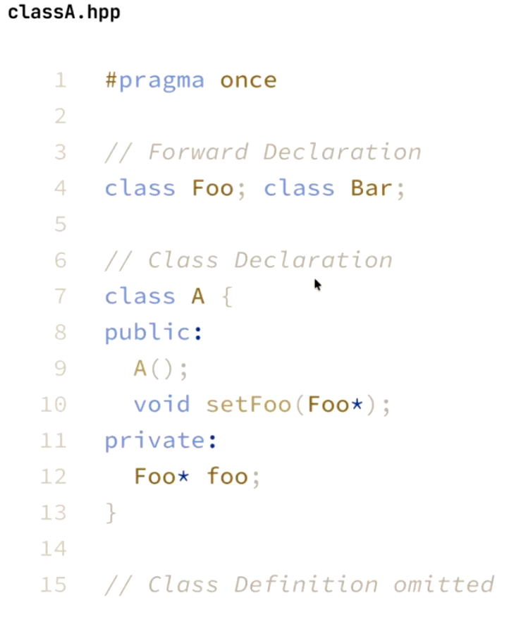
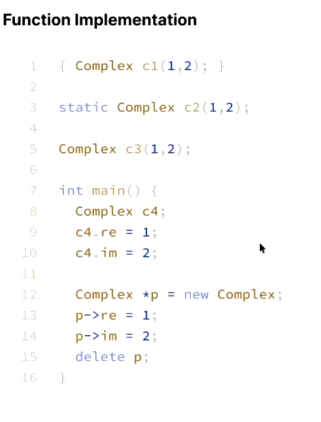
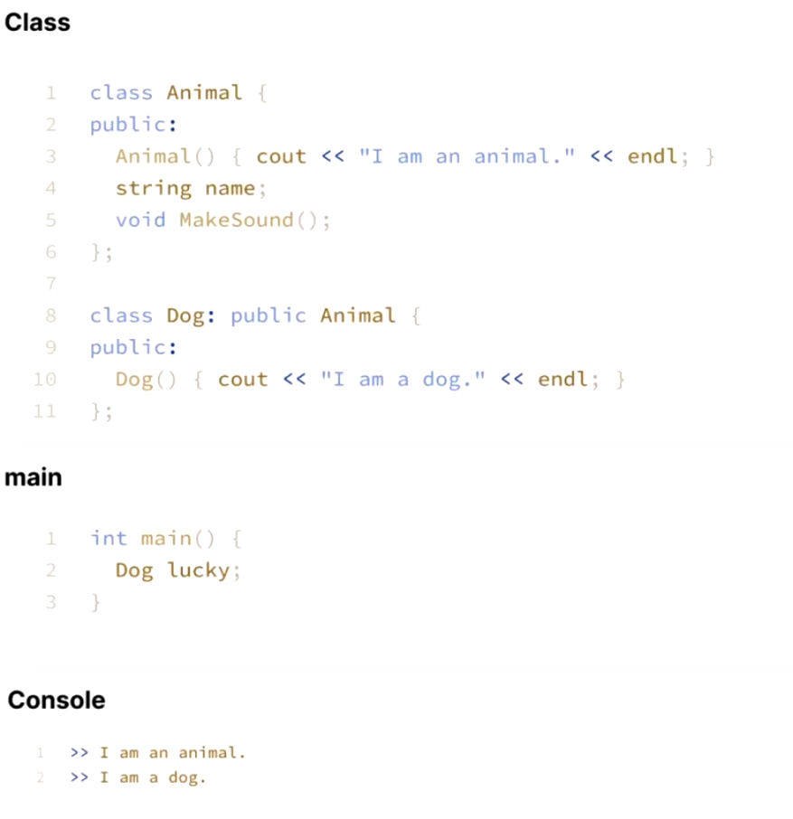
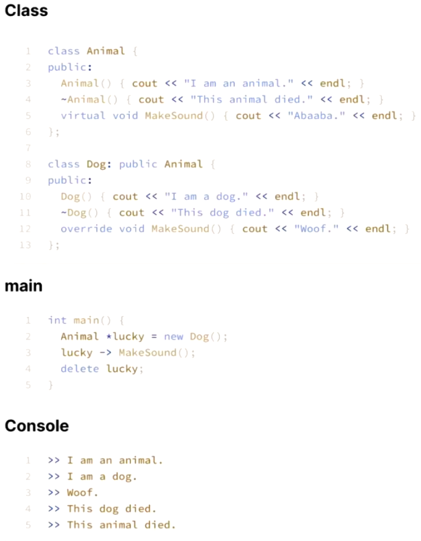

# Week 5 Notes
In this week, we reviewed the fersures of C++

## Part one: Basic review
### What's the difference between C and C++?

C is a data-driven language, meaning that data and functions may be spread over files. C++ is an object-oriented language, which means the data is packed with functions in a single abstract concept.

The basic structure of a C++ program consists of three parts: the header file (.h or .hpp), the main program file (.cpp), and the standard library (STL). Header document should be used in main program as the form: include the standard library should be used in main program with the form: include\<\_\_\_\>. However, you can replace the .h and .cpp are not mandatory and can be replaced with other extensions if desired.

In terms of the function, therre are two types: pass by value and pass by reference. Most people prefer to use pass by reference because it allows them to modify the value of the variable directly. If you do not want the value to be changed, you can add a const key word. On the other hand, pass by value copies the value of the variable into the function; when the function ends, the copy is discarded.

## Part two: Object-Oriented programming
### What is a class & What is an Instance?

Simply, the class is a abstruct concept of a kind of things, and the instance is a specific example of this kind. We can see an example:

"iPhone" is not a name of any smart phone, it is a name of series of smartphones produced by Apple. In contrast, "my iPhone 16" is a real object in the world. Therefore, we can say that my iPhone 16 is an instance of class iPhone.

### Basic header syntax

From the example above, we can see that the header syntax includes three parts: forward declaration, class declaration, and class definition. The purpose of the forward declaration is to inform the compiler that it is not necessary to verify whether these classes exist at that point. The class declaration describes the contents of a class, while the class definition provides the detailed implementation of the functions within the class. Remember, we should generally avoid writing function definitions in the header file unless they are very short.

#### Ensulation
There are three levels of encapsulation: public, protected, and private. Members labeled as public can be accessed outside of the class. Members labeled as protected can only be accessed by the class itself and children classes. Members labeled as private can only be accessed by the class itself.

#### Naming convention
There is a lot of naming convertions, you can choose any one you like.

#### Constructor
The function of a constructor is to automatically initialize class members when a class object is created. When defining a constructor, it is recommended to use overrides. Moreover, if you do not provide values for some variables, the compiler will generate default values, which may cause problems. In general, remember these key words: class name, default arguments, and initialization list.

You can also create a guard by placing the constructor in the private section. This technique is mainly used in the singleton pattern.

#### destructor
A constructor is used to create a new instance, while a destructor is designed to end the lifecycle of an instance. If you use resources such as pointers that require manual deletion, you should implement the destructor yourself. Furthermore, the Rule of Three must be followed: if you manually define any one of the destructor, copy constructor, or copy assignment , you should implement all three manually. As a result, in most cases, you need to define these three functions yourself.

## Part three: Memory management
Why C and C++ are popular? A huge reason is they give programer the power to manage the memory freely.

### Stack vs. Heap

The stack is used to store local variables and function arguments. The lifecycle of records in the stack is controlled by the compiler. When the program allocates memory from the stack, the stack provides a continous memory space. Moreover, the stack is fast but has less memory than heap.

The heap is used to store pointers. The lifecycle of records in the heap is controlled by the programmer, and the heap allocates discrete memory space to store data. Although the heap is slower than the stack, it provides a larger memory space.

### Life cycle
The example below is used to discribe life cycle:

For c1, it will be constructed upon entering the {, and destructed upon leaving the }. The c1 lives at the stack.

For c2, it will be constructed when the program starts and destructed when the program ends. The c2 lives at the static storage.

For c3, it will be the same as c2. However, they differ because c2 is a static variable, while c3 is a global variable.

For c4, it will be constructed upon entering main() and destructed upon leaving main(). The c4 lives at stack.

For pointer p, it will be constructed when new is called and destructed when delete is called. The pointer p lives at the stack, while the object lives at the heap.

### Inheritence

Inheritance is used to describe the relationship between two classes. Basically, a child class (derived class) inherits the data of a parent class (base class). An example is shown below:

The sequence of construction is important. The constructor of the base class runs first, and the derived class's constructor runs. However, the destructor of the derived class runs first, then the base class's constructor runs.

### Virtual functions
Virtual functions provide a mechanism for derived classes to override functions defined in the base class. An example is shown below:

In this example, when you create an instance of the Dog class and run the MakeSound() function, the output will be  which belongs to the Dog's MakeSound() function.

However, there is a bug in the example: we must declare the destructor as a virtual function.

## Part four: C++ 11 new features

### Null pointer
It is a safer pointer to represent the NULL. 

### Auto
It is used to recognize the type of the varible automatically.

### Range-based for-loops
The more readable for-loop syntex.
